# Lesson 1: Introduction

## 0 前言

最近开始补信号处理的基础知识，该笔记是结合台湾大学李琳山教授的《数位语音处理》视频，并参考[杨明雪](https://www.zhihu.com/people/littlexue-xue-91)大佬的笔记制作。由于我主要做语音合成和语音转换，课程中某些内容就没有记录了。

## 1 背景知识

麦克风收集到的电信号X(t)是连续的，而计算机只能处理离散的信号。于是X(t)会先经过一系列电子元件转换成离散信号X[n]。这个过程叫做采样（sampling）。

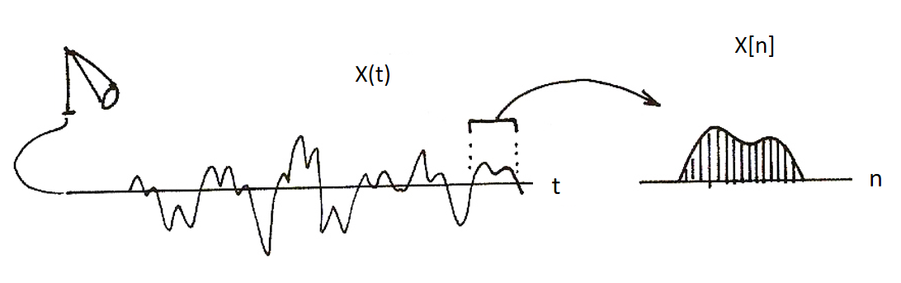

下图是数位语言处理的大体流程。X(t)在采样之前会先经过低通滤波器（low pass filter）来克服采样时的走样（alias）问题。然后采样成X[n]后送到处理算法并得到输出。

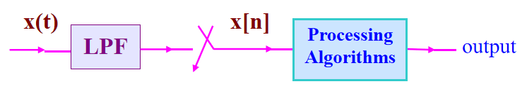

### 1.1 两大应用领域

**Speech encoding**

这一方面的技术现今已很成熟，不在本课程的讨论范围内。

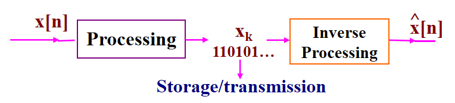

要考虑的问题有：

1. bit rate：每一秒的声音要用几个bit表示。
2. recovered quality：数字信号经过inverse processing后得到声音的质量。
3. computation complexity/feasibility：计算复杂度

**Voice-based network access**

即语音处理在网络上的各种应用。主要有：

1. User Interface
2. Content Analysis
3. User-content Interaction

### 1.2 语音信号

我们研究人类的语音信号（speech signal）出于三个原因：

1. 人类语音携带语言学信息（linguistic information）。如字（character）、词（word）、片语（phrase）、句子（sentence）和概念（concept）等。
2. 人类语音是双层信号。第一层是机器感知的声学信号（acoustic signal），第二层是人感知的符号或语言信号（symbolic or linguistic signal）。在下图中，机器看到的是一系列电信号；而人要说的是”人人用电脑“。

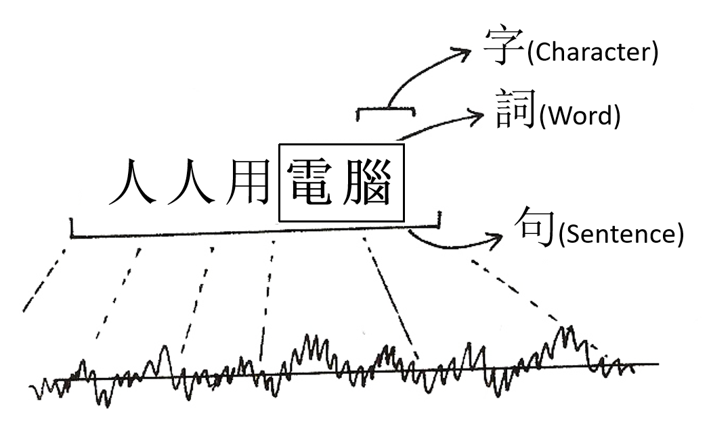

3. 我们期待处理并让双层的信号能够互动。例如在下图中，机器看到的就是一些电信号。由于人类语言是有结构的，我们不会直接就处理这些信号，而是会参考词典（lexicon）和文法（grammar）等语言知识。譬如jīn和tiān拼在一起我们根据词典知道是”今天“，而不会把jīn听成”金“。另一方面文法可以告诉我们“今天”和“的”可以连起来组成“今天的”，进一步可以与“天气”组成片语“今天的天气”。

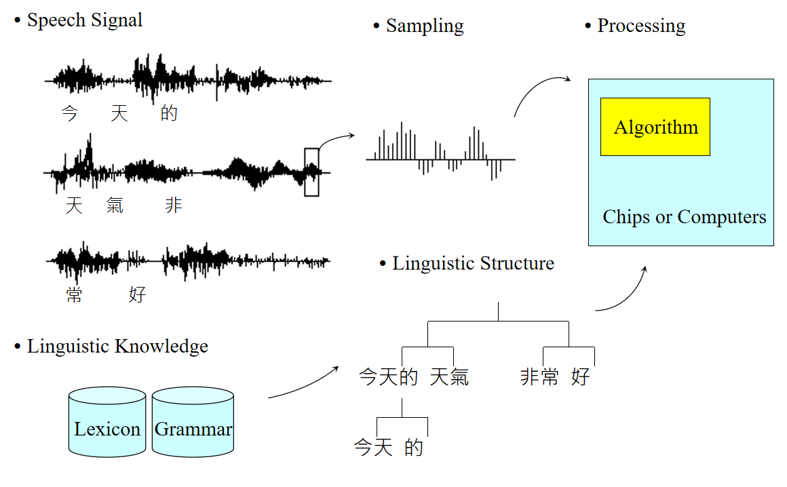

## 2 语音识别

### 2.1 模式识别

语音识别即将语音转换为文字。它和图像类似，可以看作是模式识别（pattern recognition）的任务。

首先对输入语音做特征提取（feature extraction）得到一把特征向量（feature vector）。然后将这些特征向量与已有的参考模式（reference pattern）比对，并确定该向量属于哪一个模式。例如辨识0-9这十个音，我们就要为每个音建一个pattern。

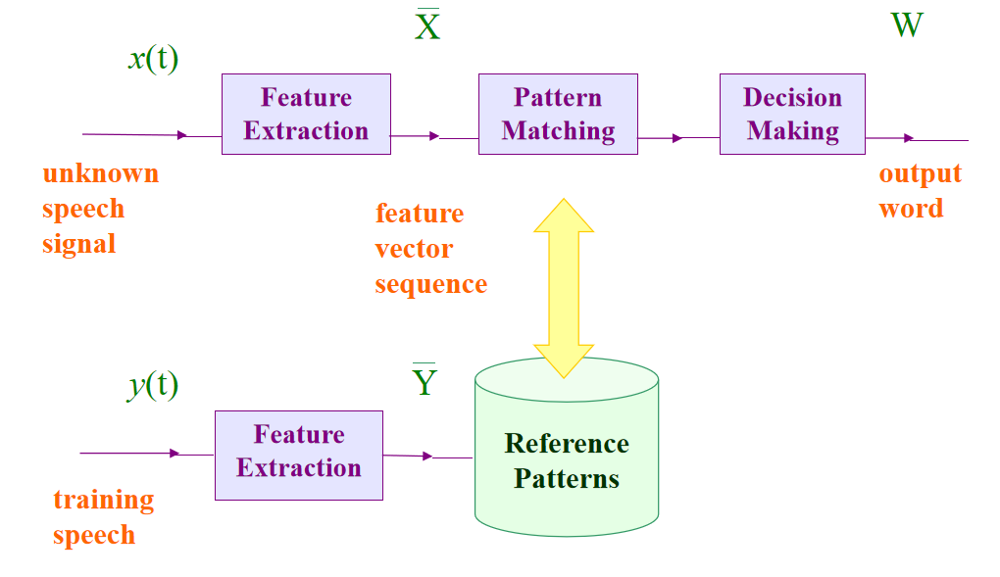

### 2.2 Large Vocabulary Speech Recognition

实际的任务并没有辨识0-9那么简单，而是处理包含了各种音的连续的（continuous）语音，且要考虑词、句等信息。处理的流程如下图：

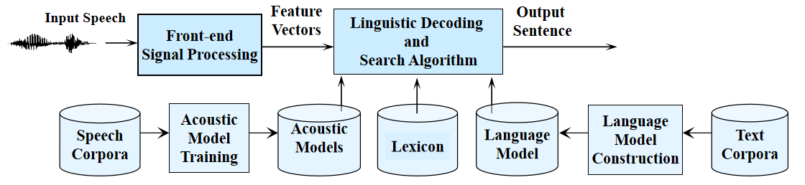

下面以输入语音为"This is speech"为例。

虽然人的语音是千变万化的，但组成语音的基本音（或者是音素）数量是有限的。于是我们可以将语音拆成一些基本音，例如"th-ih-s-ih-z-s-p-ih-ch"。然后为每个基本音建立一个pattern，就可以按照之前模式识别的方法做了。

我们可以使用大量语料训练**声学模型（acoustic model）**。它可以将输入语音转成基本音。我们要借助**词典（lexicon）**将它们拼起来组成一个个词，如"th-ih-s"拼成"this"。然而，有些音是很难分辨的，比如"th"和"s"。于是机器只能给出各个基本音的概率。而这些可能的基本音又可以串起来组成各种各样的词。

为了确定哪一种词的组合可能性最大，需要借助**语言模型（language model）**。它可以根据之前的词给出当前某个词出现的概率。换言之就是几个词一起出现的概率。n-gram的语言模型是指根据前n-1个词确定第n个词出现概率的模型。例如"this is speech"出现的tri-gram概率为：

P(this is speech) = P(this) P(is | this) P(speech | this is)

### 2.3 应用与挑战

**应用**

1. Word Recognition：如语音命令。
2. Keyword Spotting：从输入语句中识别预设的关键词。
3. Large Vocabulary Continuous Speech Recognition：如通过语音识别做会议记录。

**挑战**

1. Speaker Dependent/Independent/Adaptive：dependent指对特定的人做语音识别；independent指可以对不同人做语音识别；而adaptive指模型可以做不同人的语音识别，但准确率可能不高。如果我们多给它某个人的数据训练，模型就可以适应该语者，即识别其语音的准确率提升。
2. Acoustic Reception/Background Noise/Channel Distortion：信号接收、环境噪音和传输失真等因素都会影响语音识别的准确率。
3. Read/Spontaneous/Conversational Speech：read指朗读的语音；spontaneous指无意识的连读，例如将”这样子“读成”酱紫“；conversational指特定人之间的一些说话方式，如暗号、昵称、梗等。

## 3 语音合成

语音合成（speech synthesis），即输入一段文字并将其转成一段语音。

首先我们会借助词典和规则将输入文本转成基本音。接着将基本音输入到**prosodic model**让生成的语音能更真实（natural-sounding）。这里的prosody可以理解为抑扬顿挫，如汉语的四个声调和英语句子不同的stress。最后再经过处理拼接出一段语音。

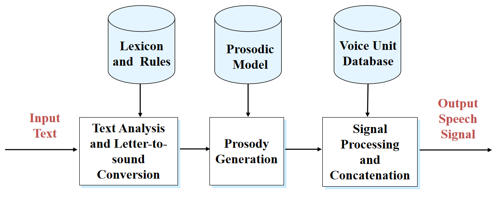

## 4 语音理解

语音理解（speech understanding）要求机器不仅仅停留在能将语音转成文字，还要能理解说话人的意图（intention）。这是一个很难的任务，通常只在有限的领域和任务中有比较好的表现。

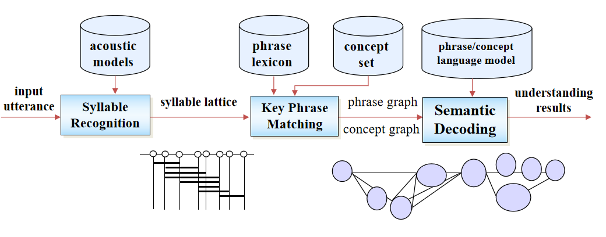

例如：

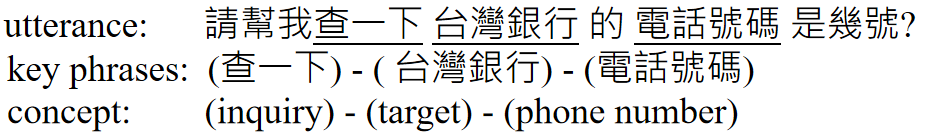

## 5 声纹识别

声纹识别（speaker verification）的任务是通过语音来确定说话人的身份。它可以分成两类：

1. Text dependent：即说出某一段特定的话就可以认证成功。
2. Text independent：不必说特定的话，但要特定的人来说。

除此之外，声纹识别还可以和其他认证方法一同使用，例如要求特定的人念出一段密码（speaker identity + password）。

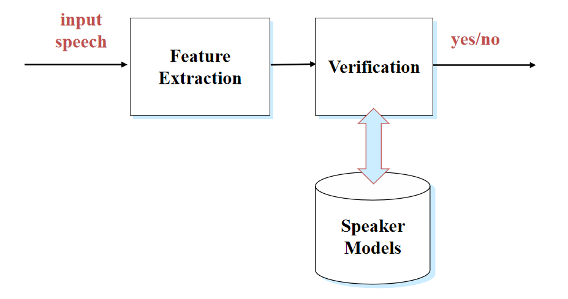

## 6 参考

[投影片 1 (ntu.edu.tw)](http://speech.ee.ntu.edu.tw/DSP2019Spring/Videos/20190220_1/index.html)

[数位语音处理概论-台湾大学李琳山Lesson1 - 知乎 (zhihu.com)](https://zhuanlan.zhihu.com/p/64924318)

