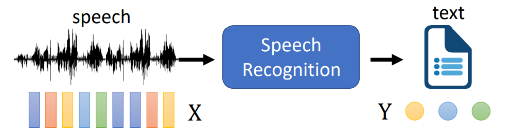
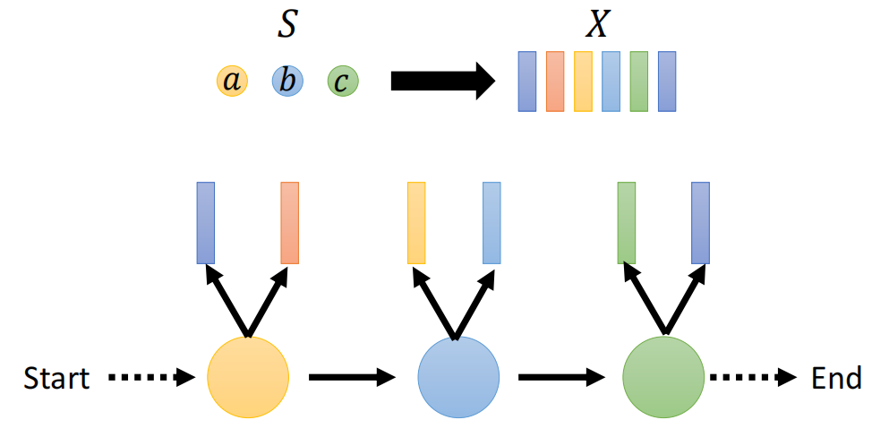
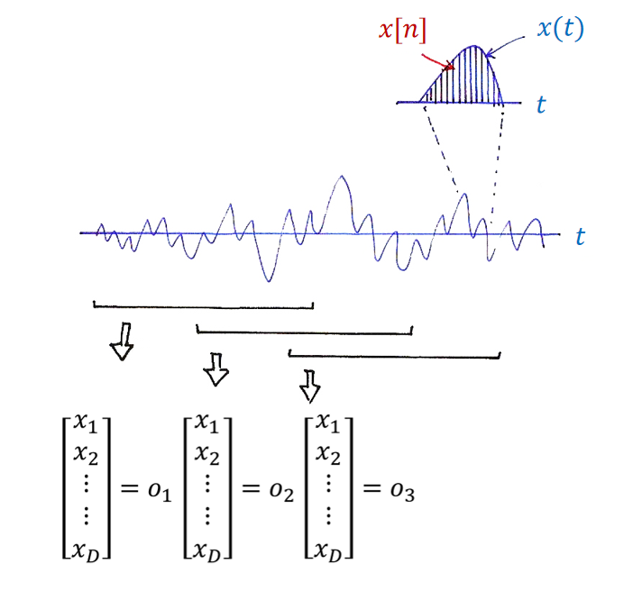
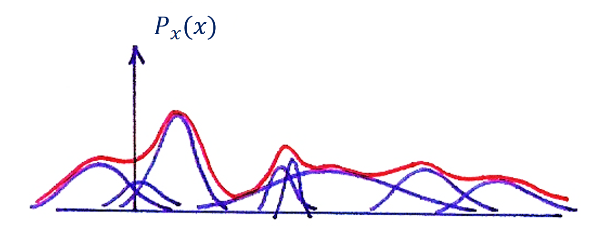

# Lesson 2: Speech Recognition

## 0 前言

课程主页：

[Speech Lab - Introduction to Digital Speech Processing (ntu.edu.tw)](https://speech.ee.ntu.edu.tw/DSP2021Autumn/)

## 1 隐马尔可夫模型

隐马尔可夫模型（Hidden Markov Model, HMM）是语音识别中最基本的模型。近来，许多深度模型似乎可以不再藉由HMM也能做出不错的效果，但实际上它们可能借助了HMM的一些观念或者模型学到了与之类似的方法。

### 1.1 语音识别

语音识别任务就是输入一段语音，输出其对应的文本。下图中，$X$是语音对应的一串声学特征（acoustic features），$Y$是对应的token序列。

我们的目标是：
$$
Y^*= \mathop {argmax} \limits_{Y} P(Y|X)
$$
它称为**后验概率（posterior probability）**，意思是我们在有一个观测量$X$的情况下计算$Y$的概率。又根据贝叶斯公式有：
$$
Y^* = \mathop {argmax} \limits_{Y} \frac{P(X|Y)P(Y)}{P(x)}
$$
由于式子的变量是$Y$，$P(X)$不影响最终优化的结果，于是忽略：
$$
Y^*= \mathop {argmax} \limits_{Y} P(X|Y)P(Y)
$$
其中$P(Y)$是**先验概率（prior probability）**，其含义是某一串token出现的概率，由语言模型（language model得到；而$P(X|Y)$的含义是给定token序列$Y$，我们要得到其对应的声学特征$X$，由HMM得到。

### 1.2 状态序列

HMM用一系列states来描述语音随时间的变化。任何一段声音都可以用这些states来描述。例如念`零`，我们可以将其语音分成很多个states。靠前的states可能对应到`l`的发音；而靠后的states则对应到`ng`的发音。States的数目由人工设定，越大则模型越精细，但相应的就需要更多的数据训练。

上述token序列$Y$就对应到一段状态序列$S$。

一般不会选择character作为state。这是因为同一个可能对应着不同的发音。例如英语中的`c`既可以发`s`，又可以发`k`。因此首先会将character转成phoneme。进一步，可以让每个phoneme同时考虑其前后的phoneme，那就有了tri-phone。接着对于一个tri-phone，可以将其划分为3个状态：

### 1.3 观测序列

一段语音在输入到HMM模型之前会做特征提取得到一系列声学特征$o_1, o_2, ..., o_n$。

### 1.4 三个概率

隐马尔可夫模型之所以带一个隐字，就是其状态之间的转移是随机的。

如上图state 1有$a_{11}$的概率转移到state 1，即状态不变；由$a_{12}$的概率转移到state 2；有$a_{13}$的概率转移到state 3。当然，它也可以转移到state 4等等，但概率就不见得很大。要注意的是，状态是不能往回跳的。

上述的概率叫做**转移概率（transition probability）**。设共有$N$个状态，我们可以用一个矩阵$A$来表示各个状态之间的转移概率。$a_{ij}$表示t-1时刻状态为i，t时刻状态为j的概率。可以想象，状态不变和转移到下一个相邻状态的概率会比较大，即斜对角线上的值较大，而越靠近右上角，值就越小。另一方面，由于状态不能回跳，下三角的值都为0。
$$
\begin{bmatrix}
a_{11} & \dots & a_{1N}\\
&\ddots & \vdots \\
a_{N1}& & a_{NN}
\end{bmatrix}
$$
$q_i$表示$o_i$属于的状态号（state number），那么$q_i \in \{1, 2, ..., N\}$。

$b_i(o)$表示第i个状态的**发射概率（emission probability）**。其含义是给定一个state i，它产生某个样子的特征向量$o_i$的概率（样子指的就是向量各个维度的取值）。这个概率是服从某个分布的，但我们并不知道具体分布的表达式。于是可以使用一系列正态分布去拟合它，即[高斯混合模型（Gaussian Mixture Model, GMM](https://zhuanlan.zhihu.com/p/30483076)。

每个状态对应分布不同，也就有不同的发射概率。用$B=[b_j(o), j=1, 2, ..., N]$表示。

HMM中还设置了**起始概率（initial probability）**，表示从第几个状态起始的概率，记作$\pi = [\pi_1, \pi_2, ..., \pi_N]$。例如$\pi_1$表示以第一个状态作为起始的概率。

最终，由$A, B, \pi$就可以确定一个HMM，即：
$$
(A, B, \pi)=\lambda
$$

### 1.5 总结

HMM是一个**双层的随机过程**：

1. 状态转移是随机的。如此的设计可以很好表示语音内在的变化。例如某人说同一个词`programming`几次，每次说的快慢可以是不一样的。
2. 给定一个状态，HMM产生的特征向量是随机的。这是因为我们得到这个向量的方式是从其服从的分布上采样的。

本节课只是初步了解了HMM的思想，但要运用它，我们还面临一些问题：

1. Evaluation problem：给定一段声音的声学特征$o=[o_1, o_2, ..., o_T]$，找到使其概率$P(o|\lambda)$最大的模型。例如我们0-9这10个音分别对应的10个模型$\lambda_0, \lambda_1, ..., \lambda_9$。那么我们把`8`的声音的声学特征丢进去，应该$\lambda_8$对应的概率最大。

2. Decoding problem：给定一段声音的声学特征$o=[o_1, o_2, ..., o_T]$和一个模型$\lambda$，找到使概率$P(o|\lambda)$最大的状态号序列$q = [q_1, q_2, ..., q_T]$。
3. Learning problem：给定一段声音的声学特征$o=[o_1, o_2, ..., o_T]$，我们期待学到一组模型$\lambda$的参数，它能让概率$P(o|\lambda)$最大。

## 2 参考

[Speech Lab - Introduction to Digital Speech Processing (ntu.edu.tw)](https://speech.ee.ntu.edu.tw/DSP2021Autumn/)

[[DLHLP 2020\] Speech Recognition (4/7) - HMM (optional) - YouTube](https://www.youtube.com/watch?v=XWTGY_PNABo)

[数位语音信号处理概论Lesson2-初识HMM - 知乎 (zhihu.com)](https://zhuanlan.zhihu.com/p/65049637)

[高斯混合模型（GMM） - 知乎 (zhihu.com)](https://zhuanlan.zhihu.com/p/30483076)