# Lesson 2: Speech Recognition

## 0 前言

在第一课中我们已经了解了语音识别的大致流程（如下图）。上一节学习的隐马尔可夫模型（HMM）就是声学模型（acoustic model）。本节将介绍前端信号处理（signal front-end processing）和语言模型（language model）。

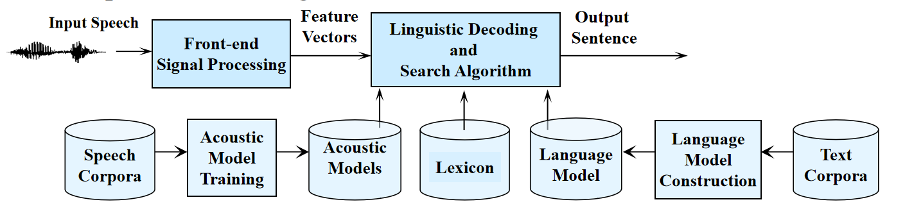

## 1 人耳构造

人听声音时，实际上听到的是**频率**。如下图，耳蜗的管道内有液体，管道由粗逐渐变细。这一结构就决定了人耳能够识别出不同的频率。

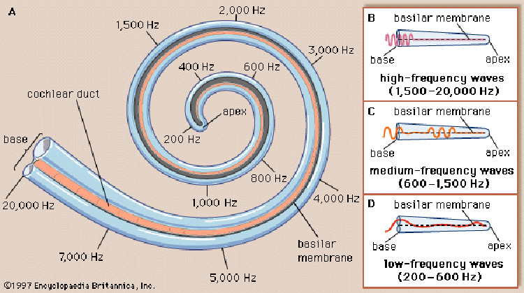

人对频率的感知是**一段一段的**。例如下图，人听两个红色`x`对应的的频率可能感受不出差异，但听一个红色和一个蓝色`x`对应的频率则能感受到区别。这是因为同一个神经元的神经末梢会覆盖一定区域的频率。在红色范围内的频率可能都由一个神经元负责听，那么人感受不到差异。然而蓝色范围内的频率可能是另一个神经元负责听，那么人就可以察觉到不同。另外，这两个神经元会有重合（overlap）的区域。

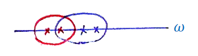

要注意的是虽然人对频率的感知是一段一段的，但频率数值上并不是线性变化的，而是按对数函数变化。可以想象人耳对低频信号会更加敏感。因为在低频段，频率稍有改变，梅尔刻度值就会有较大改变。

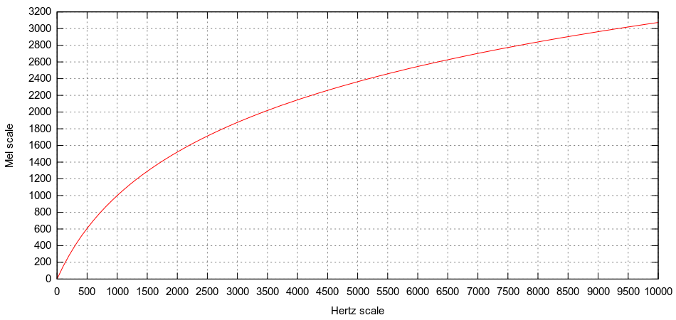

公式为：
$$
m=2596\log_{10}{(1+\frac{f}{700})}
$$
其中$f$为以赫兹为单位的频率，$m$为对应的梅尔刻度（mel scale）。通常使用80或128个刻度值。

## 2 前端信号处理

### 2.1 预加重

首先要明确的是元音的频率较低而辅音的频率较高。其次，辅音携带的信息更多。例如Microsoft只保留辅音mkrsft，我们仍然可以明白其意思。

然而，由于口唇辐射效应，声音的低频部分受影响不大但高频部分会受到抑制。于是会先对语音做预加重（pre-emphasis）来消除该影响。传递函数为：
$$
H(z) = 1-az^{-1}
$$
也就是：
$$
x[n] = x[n] - ax[n-1]
$$
其中$0\ll a<1$，通常取0.98。处理后的效果如下图所示，蓝色为原来频率的magnitude，红线后预加重后的magnitude。

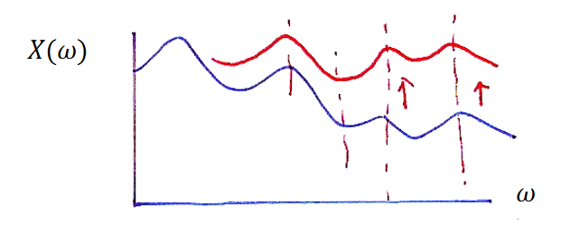

### 2.2 端点检测

第二件事情就是端点检测（endpoint detection）。这是考虑到我们并不是时时刻刻都在讲话，即一段语音中会有silence。但silence并不是没有任何声音，它其实包括了环境中的噪音。人可以很清晰地分辨一段语音中哪里是在说话哪里是噪音，但机器做不到。我们不希望机器把噪音也当作说话处理。

一个最基本的方法是计算语音的能量（energy）。我们在语音上取一个个的window，并计算window内所有点的energy。某个点对应的energy就是其幅度的平方（平方是考虑到幅度值有负数的情况）。

我们还会设定一个threshold来判断哪些是在说话哪些是噪音。设定的方法可以是在不说话的情况下测定一段声音的energy。

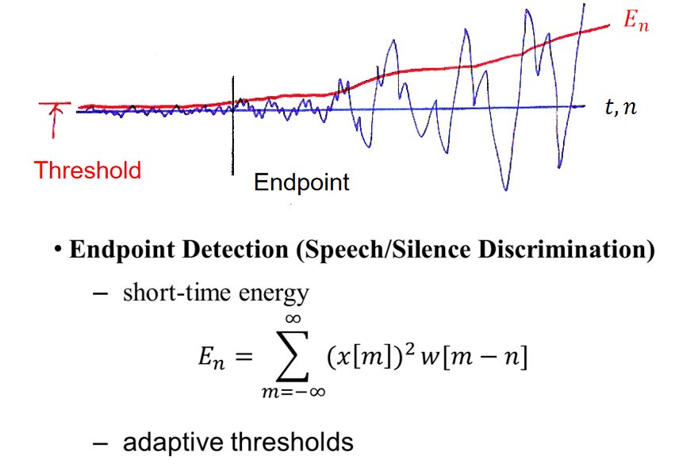

接下来讨论如何加窗（windowing）。

**矩形窗**

这是最直觉的想法，窗内取值为1，窗外取值为0。但其存在的问题是在滑动时容易发生energy的突变。

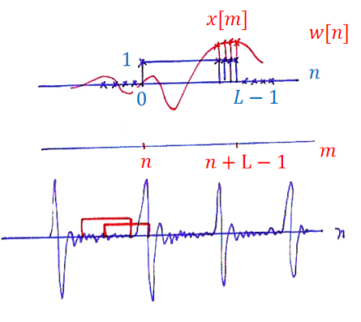

窗函数为：

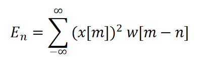

**Hamming窗**

设计的想法就是让窗内值得变化呈现出中间高两边低的状态。

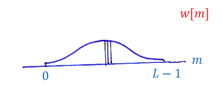

窗函数为：

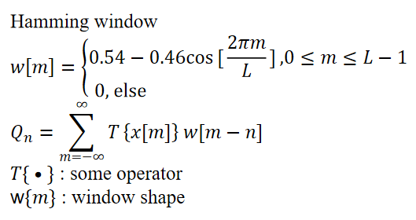

### 2.3 梅尔频率倒谱系数

提取梅尔频率倒谱系数（Mel Frequency Cepstral Coefficients, MFCC）的过程如下图所示。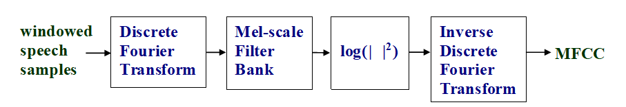

加窗后得到的语音信号透过离散傅里叶变换后得到信号在频率上的分布。

接下来经过一系列mel-scale filters（bank的意思就是有很多filters）处理。这些filters的排布就遵行了人耳听取频率的特点，相当于一个个神经元。

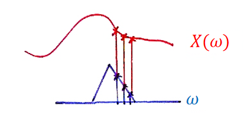

这些filters之间也有重合（overlap）。另外，为了不让低频部分的filters太密集，filter之间频率上的距离只有**在高频部分（大于1kHz）按对数方式变化，而在低频部分（小于1KHz）则是按线性方式变化**。然后再平方取对数是考虑到人对energy的感知也是遵循对数变换规律的。

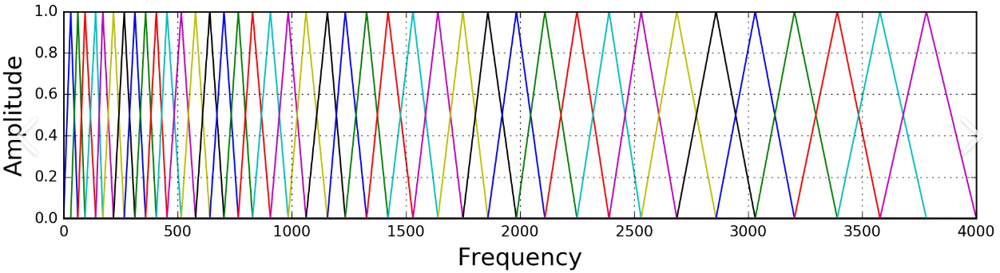

由于语音信号是时域连续的，分帧提取的特征信息只反应了本帧语音的特性，为了使特征更能体现**时域连续性**，可以在特征维度增加前后帧信息的维度。我们会将求出的13维向量再对其求一次微分和两次微分，并拼接起来得到最终的MFCC。可以类比位移、速度和加速度。

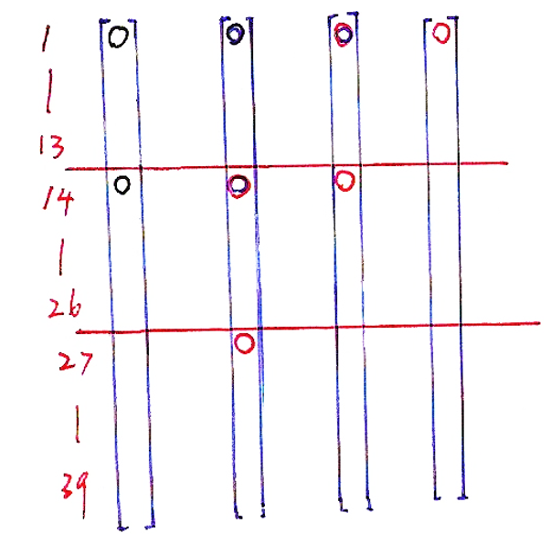

## 3 N-gram语言模型

设$W=(w_1, w_2, ..., w_R)$是一个词串（也可以是字）。我们认为第$i$个词出现的概率与前$i-1$个词都有关，那么该词串出现的概率为：
$$
P(W)=P(w_1)\prod\limits_{i=2}^RP(w_i|w_1, w_2, ..., w_{i-1})
$$
但是这种方法需要的计算量实在太大。于是工程师们提出了一个不合理但效果还不错的方法，即第i个词出现的概率只与前$N$个词有关。这也就是所谓的N--gram语言模型（gram即grammar）。一般而言，$N$越大效果越好，但计算量也会随之提升。

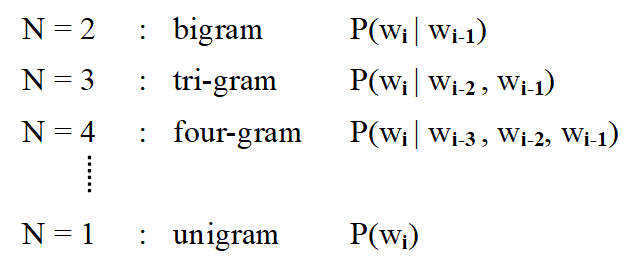

例如我们从大量文本中统计出`this`出现了50000次，`this is`出现了500次，而`this is a`出现了5次。那么可以算出：
$$
P(is|this) = \frac{500}{50000}=\frac{1}{100} \\
P(a|this\, is)=\frac{5}{500}=\frac{1}{100}
$$

## 4 语音识别流程概览

正如上一节提到的，语音识别任务就是输入一段语音，输出其对应的文本。下图中，$X$是语音对应的一串声学特征（acoustic features），$Y$是对应的token序列。

我们的目标是：
$$
Y^*= \mathop {argmax} \limits_{Y} P(Y|X)
$$
$P(Y|X)$称为**后验概率（posterior probability）**，意思是我们在有一个观测量$X$的情况下计算$Y$的概率。优化上式称为**最大化后验概率（Maximize A Posterior , MAP）准则**。又根据贝叶斯公式有：
$$
Y^* = \mathop {argmax} \limits_{Y} \frac{P(X|Y)P(Y)}{P(x)}
$$
由于式子的变量是$Y$，$P(X)$不影响最终优化的结果，于是忽略：
$$
Y^*= \mathop {argmax} \limits_{Y} P(X|Y)P(Y)
$$
其中$P(Y)$是**先验概率（prior probability）**，其含义是某一串token出现的概率，由语言模型（language model得到；而$P(X|Y)$称为**似然函数（likelihood function）**，其含义是给定token序列$Y$，我们要得到其对应的声学特征$X$，由HMM得到。

可以想象当词典很大时，寻找最优解是很费劲的。这就需要我们使用一些比较聪明的搜索方法（之后的课程会讲解）。

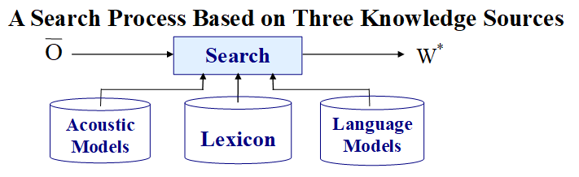

### 4.1 MAP举例

以预测天气为例，假设一天有三种可能的天气$W=(w_1, w_2, w_3)$。我们可以统计过去很长一段时间内天气情况并计算某一天出现的概率，即**先验概率**。我们固然能直接使用先验概率来预测明天的天气，但准确率都不会超过先验概率。于是，可以**观测**今天的天气$O$来来预测明天的天气，即：

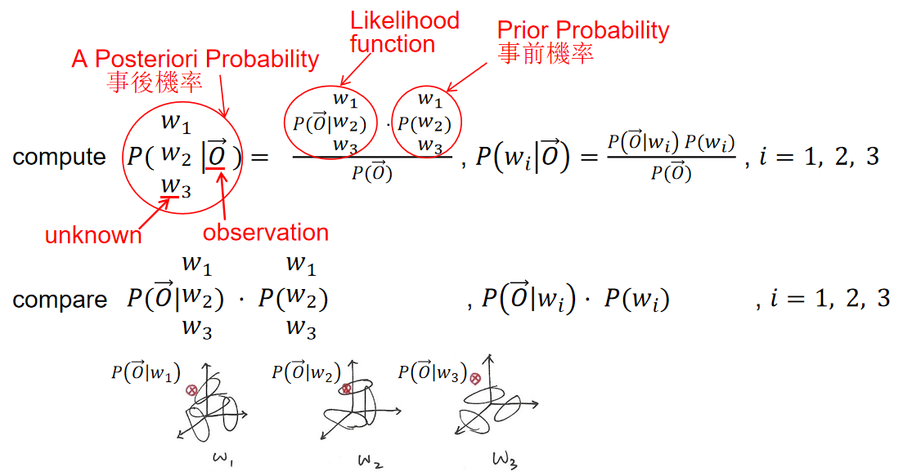

## 5 参考

[Speech Lab - Introduction to Digital Speech Processing (ntu.edu.tw)](https://speech.ee.ntu.edu.tw/DSP2021Autumn/)

[[DLHLP 2020\] Speech Recognition (4/7) - HMM (optional) - YouTube](https://www.youtube.com/watch?v=XWTGY_PNABo)

[音频不同频率给人耳的听觉 - 知乎 (zhihu.com)](https://zhuanlan.zhihu.com/p/113168237)

[语音合成基础(3)——关于梅尔频谱你想知道的都在这里 - 知乎 (zhihu.com)](https://zhuanlan.zhihu.com/p/421460202)

[语音从入门到放弃 - 知乎 (zhihu.com)](https://www.zhihu.com/column/c_1097098125260451840)

[预加重的原理是什么？ - 知乎 (zhihu.com)](https://www.zhihu.com/question/49853988/answer/120000867)

[Mel scale - Wikipedia](https://en.wikipedia.org/wiki/Mel_scale)

[MFCC(Mel Frequency Cepstral Coefficient)提取过程详解 - 简书 (jianshu.com)](https://www.jianshu.com/p/73ac4365b1d3)