# Lesson 4: More About Hidden Markov Models

## 0 前言

上一节中介绍了如何解决evaluation problem和decoding problem。本节重点介绍剩下的learning problem。

2021秋课程主页：

[Speech Lab - Introduction to Digital Speech Processing (ntu.edu.tw)](https://speech.ee.ntu.edu.tw/DSP2021Autumn/)

## 1 Baum-Welch Algorithm

### 1.1 问题介绍

首先，假设我们已经有了一个初始模型（initial model）$\lambda=(A, B, \pi)$和一串用于训练的观测序列$O$。我们期待用该观测序列训练此模型，让$P(O|\lambda)$最大。

要注意的是此时我们已经有了一些模型，只是它们还不太好。例如辨识0-9，那么我们会有10个已经训练过的模型。现在手上有一串8对应的观测序列，我们就把它丢到8对应的模型来训练，期待$P(O|\lambda)$最大。

首先定义变量$\gamma_t(i)$，其含义是模型再看到整个序列的情形下，$q_t=i$的概率。分子部分已经在上一节中介绍。

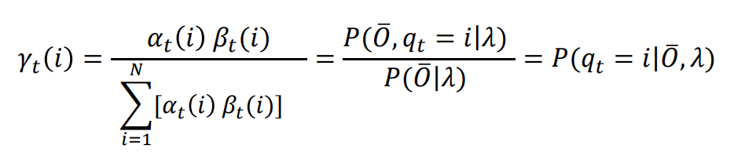

类似地，定义变量$\epsilon_t(i, j)$，其含义是模型在看到整个序列的情形下，$q_t=i$且$q_{t+1}=j$的概率。

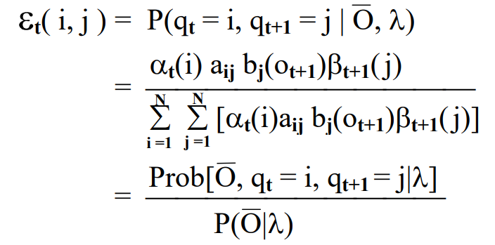

如下图，使用forward algorithm可以计算出$\alpha_t(i)$，即模型看到了$[o_1, o_2, ..., o_t]$且$q_t=i$的概率；使用backward algorithm可以计算出$\beta_{t+1}(j)$，即模型看到了$[o_{t+2}, o_{t+3}, ..., o_T]$且经过$(t+1, j)$。这两个概率之间再乘上$a_{ij}b_j(o_{t+1})$就可以将红蓝框以及$(t, i)$和$(t+1, j)$连起来。

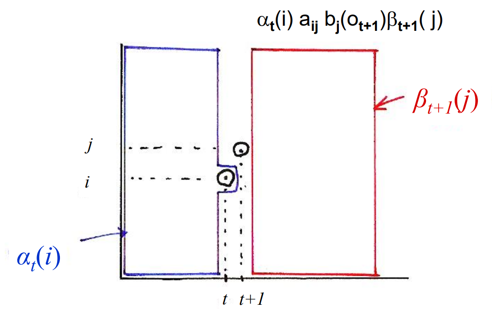

可以想象$\alpha_t(i)a_{ij}b_j(o_{t+1})\beta_{t+1}(j)$的含义就是模型看到了整个观测序列$O$且$q_t=i$和$q_{t+1}=j$。

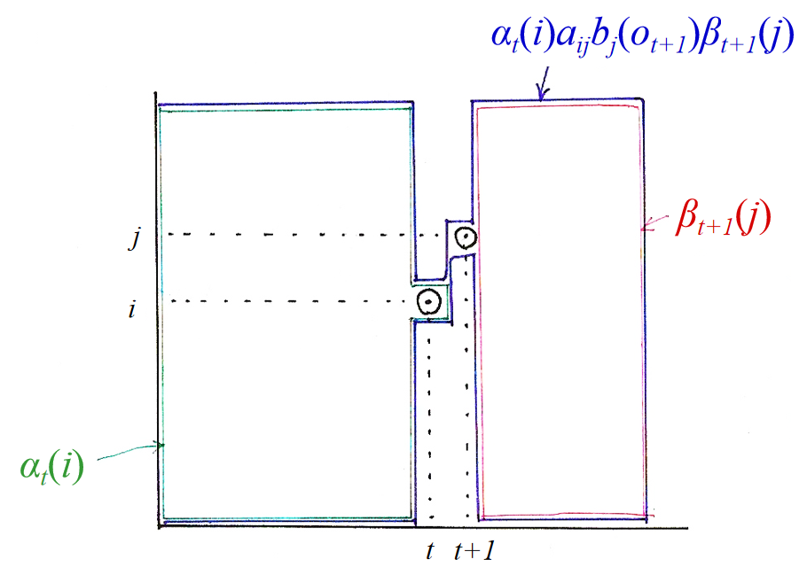

由于计算$\epsilon_t(i, j)$时同时用到了forward和backward算法，Baum-Welch algorithm也称为forward-backward algorithm。

### 1.2 更新转移矩阵

如下图，$\gamma_t(i)$只考虑路径中包含$(t, i)$一个点的概率；而$\epsilon_t(i, j)$则考虑了相邻时间中$(t, i)$和$(t+1, j)$两个点的概率。

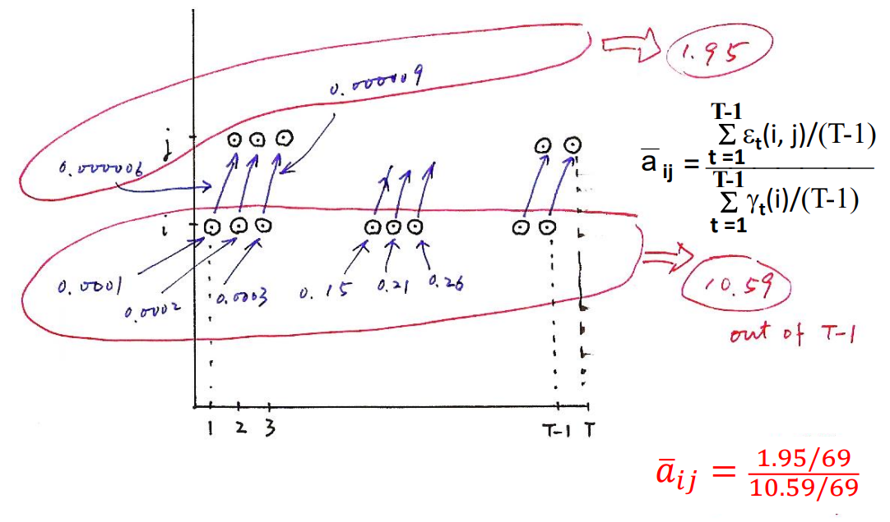

$\gamma_t(i)$即$P(q_t=i|O, \lambda)$；$\epsilon_t(i, j)$即$P(q_t=i, q_{t+1}=j|O, \lambda)$。由条件概率公式可得：
$$
\frac{P(q_t=i, q_{t+1}=j|O, \lambda)}{P(q_t=i|O, \lambda)}=P(q_{t+1}=j|q_t=i, O, \lambda)
$$
很直觉就可以得到更新转移概率$a_{ij}$和更新起始概率$\pi_i$的公式。

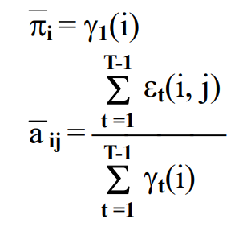

### 1.3 更新GMM

每个state会对应一个用GMM拟合的概率分布。我们要更新的参数是每个子分布出现的概率、均值向量和协方差矩阵。

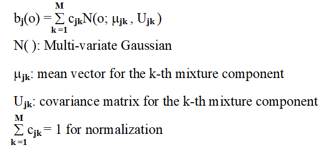

定义变量$\gamma_t(j, k)$，它要求首先是$\gamma_t(j)$，然后还要乘上该状态对应GMM中第$k$个子分布的概率，即：
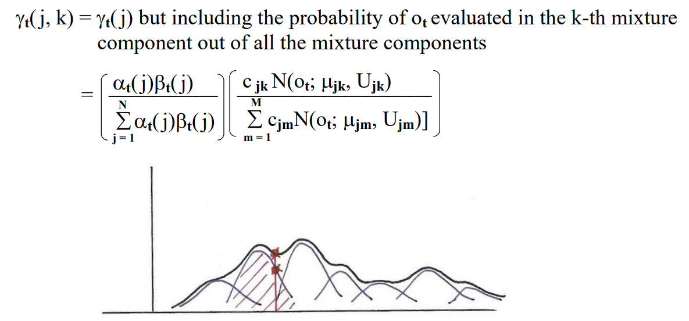

则更新$c_{jk}$的公式为：

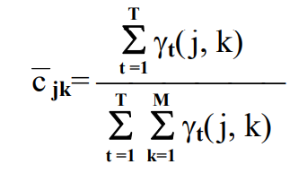

拆开来看式子的含义：

1. $\gamma_t(j)$：模型在看完整个序列$O$的前提下，$q_t=j$的概率。
2. $\gamma_t(j, k)$：模型在看完整个序列$O$的前提下，$q_t=j$且从GMM中抽到第$k$个分布的概率。
3. $\sum\limits_{t=1}^T\gamma_t(j, k)$：因为序列$O$中的每个向量$o_t$都有可能对应到state $j$，所以要求和。
4. $\sum\limits_{t=1}^T\sum\limits_{k=1}^M\gamma_t(j, k)$：含义同分子，但考虑了GMM中所有子分部的概率。其实就是分子标准化成一个概率。

接下来就是更新均值向量和协方差矩阵。
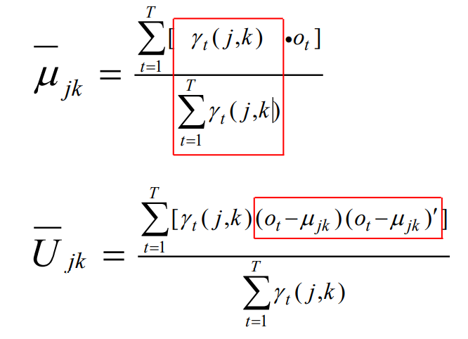

### 1.4 更新HMM

知道了如何由一笔data来更新一个**训练过的**模型的参数后，我们可以通过迭代的方式来更新HMM，直到$P(O|\lambda$)不再变化为止。

但是，我们反复强调上述过程是针对一个已经训练的过的模型。它虽然不够好，但也是我们之前用训练出来的。我们期待它再吃一些新数据后能变得更好。那么现在就面临几个问题：

1. 如何得到初始模型？
2. 如何获得一组好的初始华参数？

## 2 Quantization

量化（quantization）是一种很好的压缩数据方法。其核心就是用一个值来代表（represent）和它相邻的一系列值。

不过在HMM中，我们的目的不是压缩，而是初始化模型参数。

### 2. 1 Scalar Quantization

一维的情形称为标量量化（scalar quantization）。例如压缩一段信号，我们可以把纵轴等分成8份。对于一个sample，我们把其实数值用一个与之最接近的离散值代替。该离散值用可以只用3个bit表示和存储。

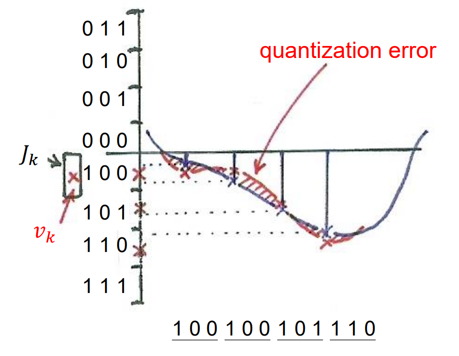

当然，也不一定要将纵轴等分。如果我们认为值比较大的信号点出现的概率较小，即大部分信号点的值都比较小。如果等分的话，值比小的地方可能就没有差异了（但我们需要区分它们）。那么可以两边疏，中间密。

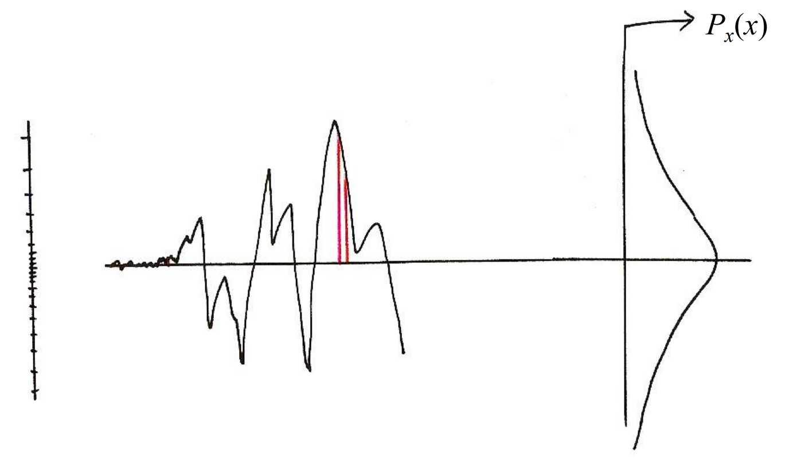

### 2.2 Vector Quantization

二维以上的情形称为相向量量化（vector quantization）。

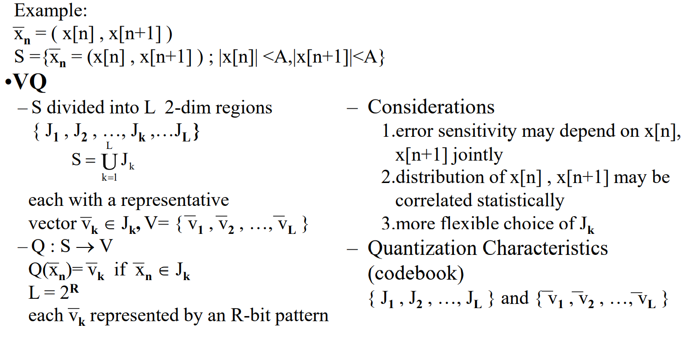

与标量量化类似，我们不一定要将区域等分，而是可以根据这些向量之间内在的联系来划分边界。这样不仅更为合理，还可以进一步压缩数据。例如将下面的区域等分，我们可能需要16个bit表示每个向量。

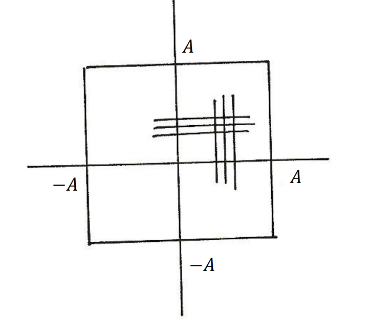

但对于向量$X_n=(X[n], X[n+1])$，由于相邻两个点的差异可能比较小，所以对角线处的点分布会比较密集，而边角处分布稀疏。这样可能就只需要10个bit来表示每个向量。

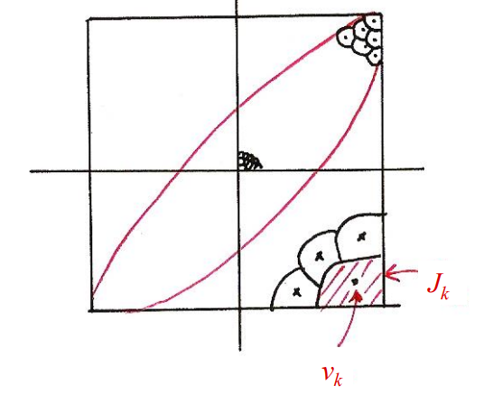

至于如何知道数据间的内在联系并根据它来划分边界，我们可以使用K均值算法。

#### 2.2.1 定义距离

距离要满足一下条件：

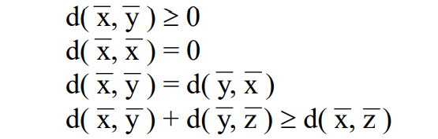

常用距离：
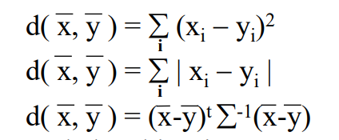

第一个是欧式距离。

第二个是city block距离。

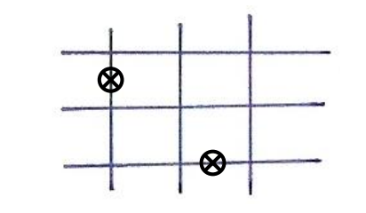

第三个距离称为Mahalanobis distance，$\Sigma$即数据的协方差矩阵。当协方差矩阵是diagonal的，向量的各个维度是independent，那么该距离就是欧式距离的每一维都normalize to该维度对应的方差。这样做可以让每个维度对最终距离的影响都相同。

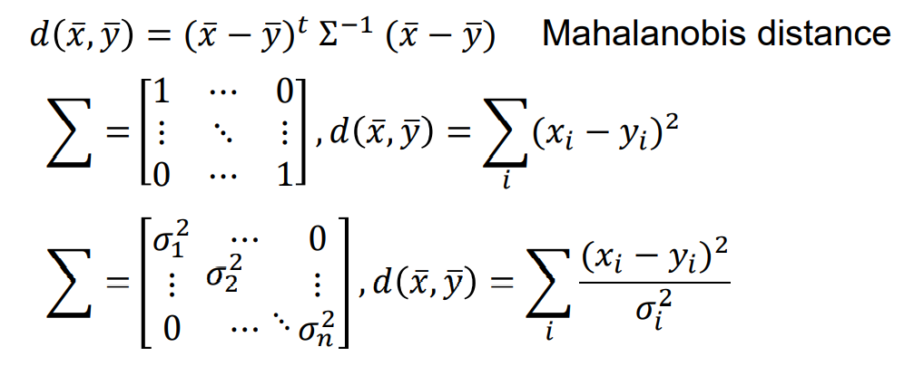

#### 2.2.2 K-Means

K均值的思想比较简单，细节不多阐述。

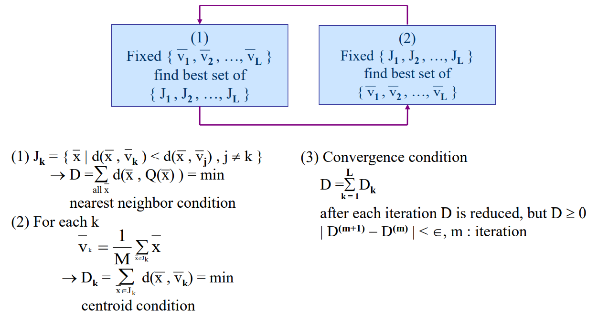

但K均值算法的表象也很依赖初始的条件。例如我们有下面这些数据。

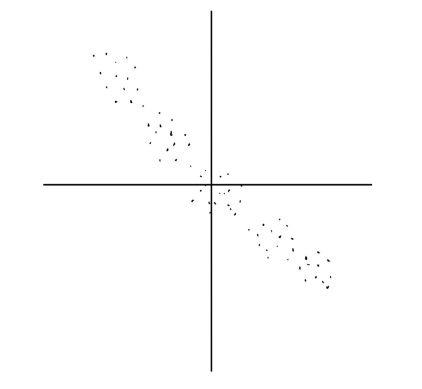

我们期待最终的聚类的结果应该是如下：

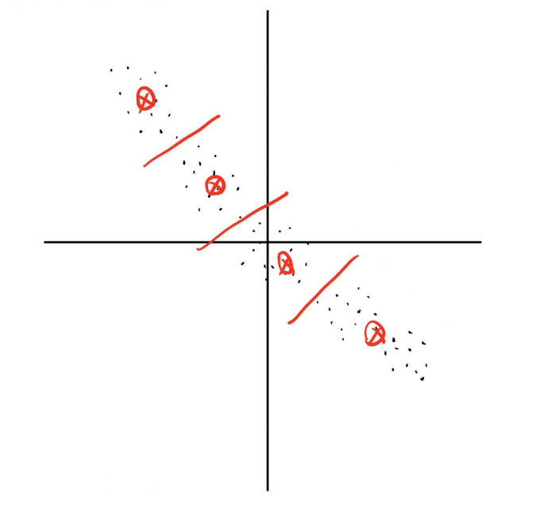

但如果在初始化时，四个聚类的代表（representative）的分布如下时，可能就很难得到期望的结果。

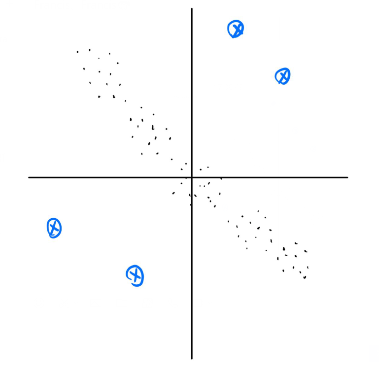

维度不超过3时，我们或许可以先将数据可视化再设置初始点。但这样并不准确和方便，而且对于高维我们很难给出较好的初始点。LBG算法就致力于解决这个问题。

#### 2.2.3 LBG Algorithm

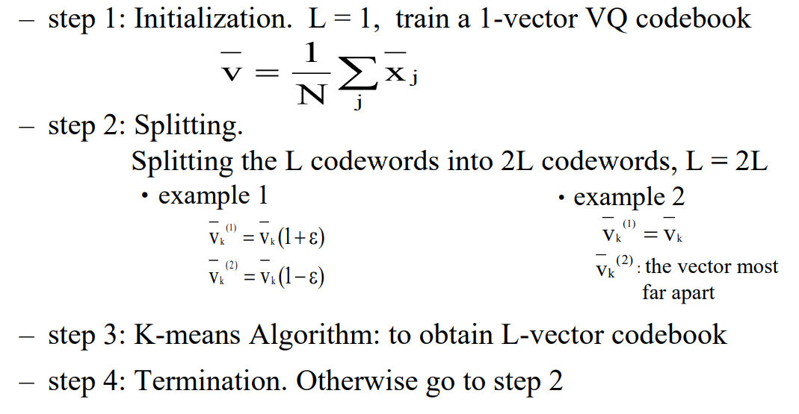

举例而言，首先我们求出所有数据对应的均值向量，它对应到一个点。然后以它为基准切出两个点，再以这两个点为初始的representative并通过比较各个点到它们的距离来聚类。接着更新representative。如此重复直到结束。

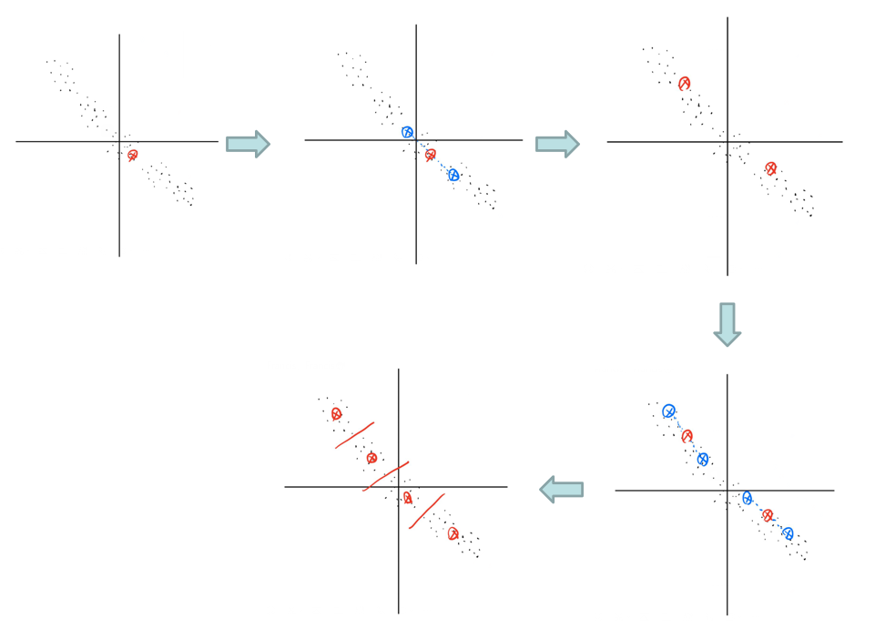

上例中第一次切分后两个点的分布很接近最终结果。当然，不可能每次都切得这么好，但LBG依然能够收敛到一个相对合理得结果：

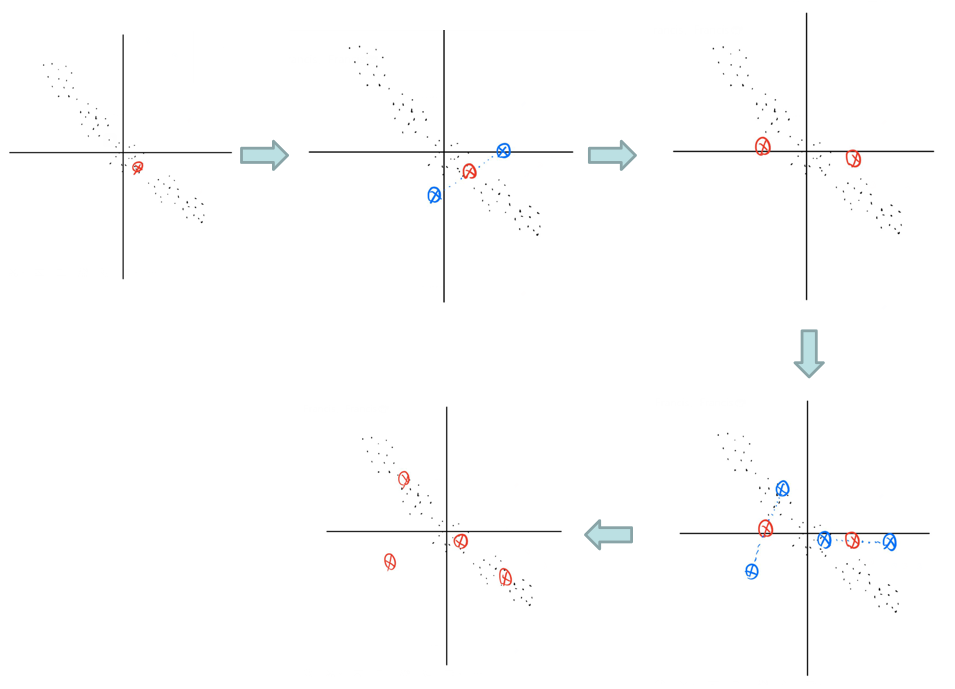

## 3 HMM Initialization

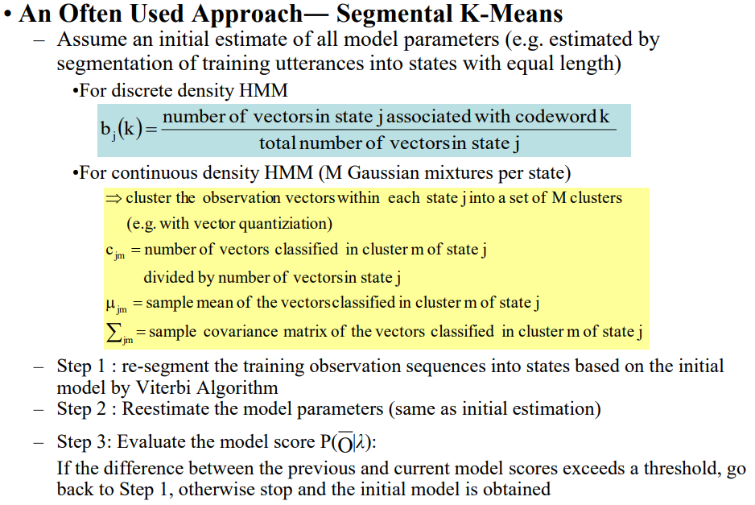

假设现在我们要初始化一个8的HMM模型，并且有一些8的训练资料。HMM中有4个state，每个state的GMM中包含了$M$个子分布。训练数据时长不尽相同。

**Initialization**

首先我们将各条训练数据对应的观测序列等分成4份，认为它们分别属于这4个state。

然后根据这些数据，使用LBG算法和K均值聚类出$M$个类。每个类就对应这一个子分布。

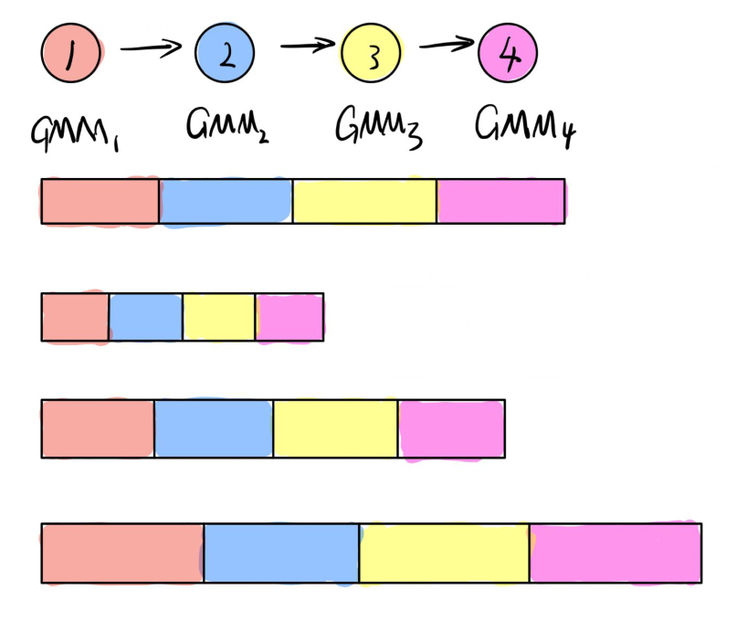

**Step 1**

利用Viverti算法为每一个观测序列都重新找出切割方案，它会比直接均分要合理。

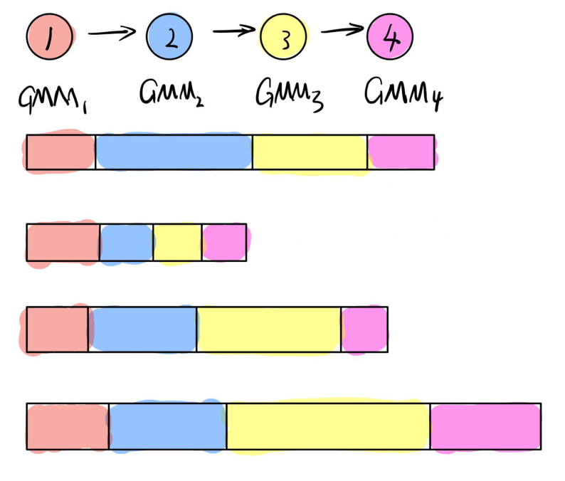

**Step 2**

根据新切割的数据来重新聚类。

**Step 3 **

接着求$P(O)\lambda)$。

重复step 1至3直到$P(O|lambda)$不再变化。

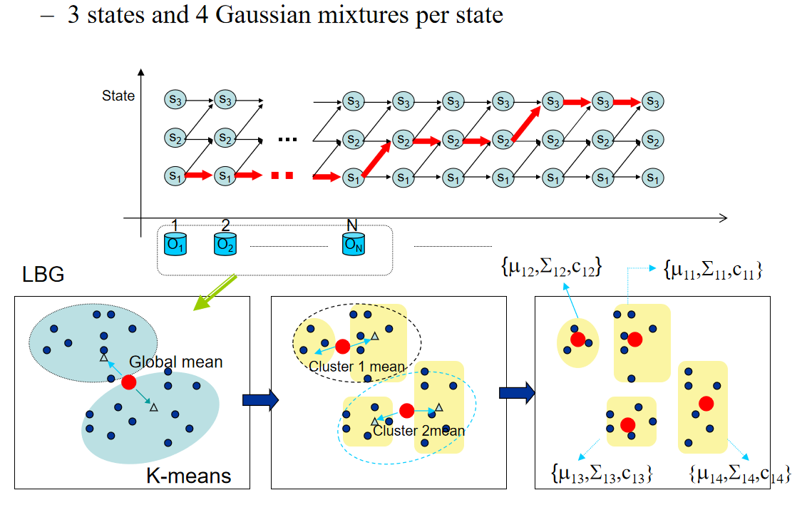

## 4 参考

[數位語音處理概論2021Autumn-week04 - YouTube](https://www.youtube.com/watch?v=amktvPoRLWk)

[数位语音信号处理概论Lesson4 后续 - 知乎 (zhihu.com)](https://zhuanlan.zhihu.com/p/101660597)