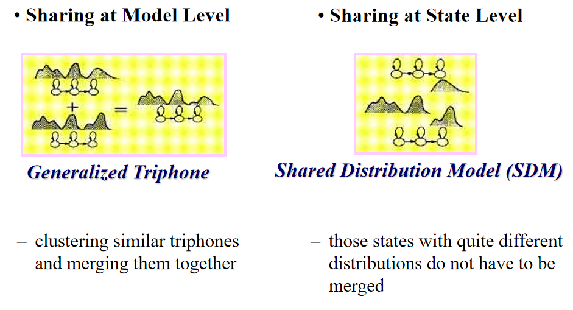
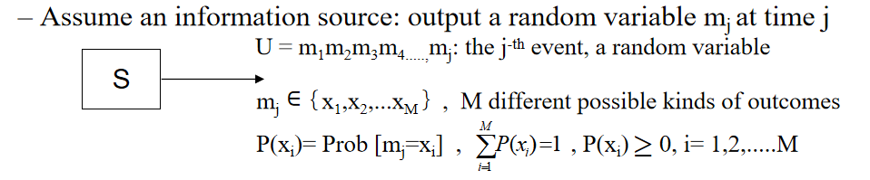
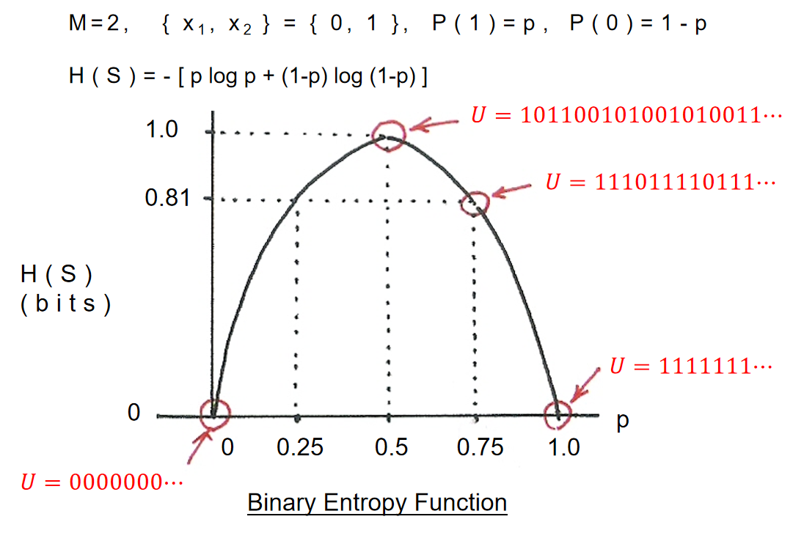
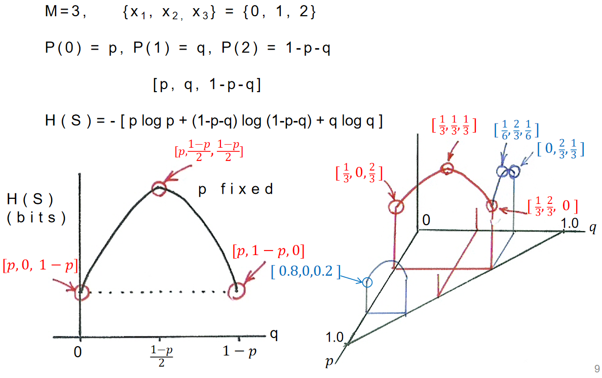
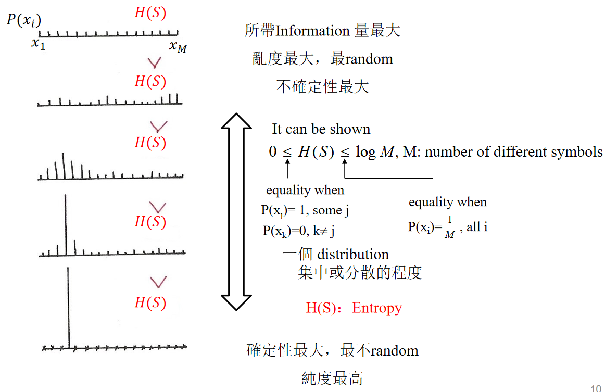
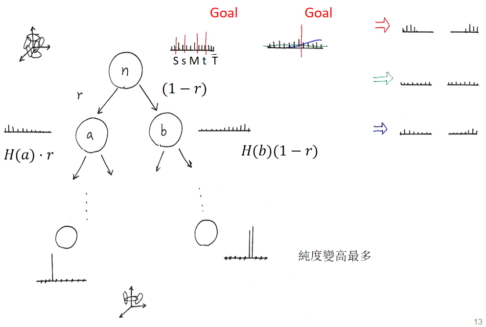
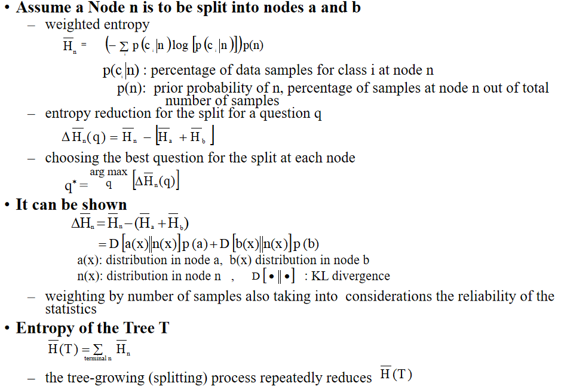

# Lesson 5: Acoustic Modeling

## 0 前言

2021秋课程主页：

[Speech Lab - Introduction to Digital Speech Processing (ntu.edu.tw)](https://speech.ee.ntu.edu.tw/DSP2021Autumn/)

## 1 Unit Selection

### 1.1 基础知识

语音识别任务中，HMM的每个state要对应到一个（或多个）token，或者说是unit。Unit可以是单词（word）、片语（phrase）和音素（phoneme）等等。选取unit时，首先要考虑一下几个方面。

1. Accuracy，即unit能准确地表示语音的acoustic realization。
2. Trainability，即我们能够得到足够的数据来训练以该unit为基础的模型。
3. Generalizability，即训练数据里没有的词也能识别出来。

接下来分析几种可能unit各自的优劣。

| Unit     | Description                                                  | Accuracy                     | Trainability                          | Generalizability | Other                                                   |
| -------- | ------------------------------------------------------------ | ---------------------------- | ------------------------------------- | ---------------- | ------------------------------------------------------- |
| Word     | 词                                                           | 如果数据足够多则精确的较高。 | 对于小型词汇表而言是trainable的。     | 不能表示新词。   |                                                         |
| Phoneme  | 音素，也称音位，是能区分语义的最小发音单位。它与phone（音）是不同的概念。Phone是phoneme的acoustic realization。 | 粒度小，可以比较精确。       | 语言的phoneme数量比较有限，容易训练。 | 能表示新词。     | 孤立的phoneme无法考虑上下文之间的关系。                 |
| Syllable | 音节，必须包括一个元音或半元音，两端是辅音或者辅音的cluster。 | 取决于语言。                 | 取决于语言。                          | 能表示新词。     | 例如日语只有50音，汉语有1300多个，而英语则有30000多个。 |

其中phoneme应该是相对而言比较好的unit，但其最大的问题在于无法考虑上下文信息，或者说周围其它phoneme的影响。举例来说，在`target`，`tea`与`two`中，词首的`t`对应到phoneme是一样的，但实际上，在念`target`中的`t`时，人的发声器官（articulators）已经准备接后面的`a`甚至`r`了，就与`tea`和`two`有微妙的不同。

这种现象称为coarticulation effects，即我们发某个音时，会受到周围其它音的影响。*The Study of Language*一书中的说明如下。

> The process of making one sound almost at the same time as the next sound is called coarticulation.

它包括了同化（assimilation）、鼻音化（nasalization）和省音（elision）。

处理上下文依赖方法有如下几种。

- Left-context-dependency，即只考虑前一个phoneme的影响。
- Right-context-dependency，即只考虑后一个phoneme的影响。
- Both，即考虑前后相邻两个phoneme的影响。
- Intra-word，即只考虑词内部的上下文依赖。
- inter-word，即还要考虑词之间的上下文依赖。

值得注意的是，通常right-context-dependency的影响要大于left-context-dependency。

### 1.2 Triphone

Triphone是一种很好的unit。它考虑了相邻两个phonome的影响，即对于某个phoneme，如果前后的phoneme不同则视为不同的triphone。例如在`sick`和`quick`中，`t`是相同的phoneme。但`t`对应的triphone为`s-ɪ-k`和`w-ɪ-k`，是不同的。

虽然triphone很好地结局了上下文依赖的问题，具有很高的accuracy和generalizability。但其数目却是非常大的，导致不好的trainability。例如一门语言中有60个phoneme，那么不同的triphone就有60的三次方个！为此，我们可以使用parameter sharing的方法将某些triphone视为一种，从而减少总数。这样会牺牲一定accuracy，但可以增加trainability。

### 1.3 Parameter Sharing

如下图，一个triphone在HMM中可能会对应多个states。Sharing at model level是指让那些相似的triphone直接共享同一个HMM模型。而sharing at state level则是让不同triphone中相似的state共用GMM。用得更多的是sharing at state level。

## 2 Information Theory

### 2.1 基础知识

如下图，一个信息源（information source） $s$ 可以产生一些列事件（event）。其中每个事件 $m_j $都是一个随机变量。它产生结果（outcome） $x_i $的可能性为 $P(x_i) $。

可以想象一种信息量的概念，它既能衡量我们看到某个事件所获得的信息多少，又能给出看完整个时间序列的信息多少。例如information source只产生0或1两个数字。如果产生1的概率为1，那么看到某个事件的结果为1时，我们没有得到任何信息，因为这完全可以推断出来。而如果产生1的概率为1/2，那么我们只有1/2的概率正确推断出事件结果。这也就意味着看到1时，我们获得了比较多的信息。进一步，如果产生0的概率很小，那么我们在一堆1中看到0时，应该会获得很多信息。

当观察到事件$m_j$的结果为$x_i$时得到的信息量$I(x_i)$应当具备以下性质。

- $I(x_i)\geq0$：信息量是非负的，我们得到的信息不会越来越少。
- $\lim\limits_{P(x_i)\to 1}I(x_i)=0$：必然出现的结果信息量为0。
- $I(x_i)\leq I(x_j)\quad if\quad P(x_i)\geq P(x_j)$：出现概率越小的结果，其携带的信息量越大。
- 信息量是可以累加的。这样我们就可以计算看到一系列事件的结果后得到的总信息量。

信息量的计算公式如下。对数的底数为2，结果的单位是**bit**。
$$
I(x_i)=\log\frac{1}{P(x_i)}=-\log P(x_i)
$$

每个事件会依概率产生不同的结果。用加权信息量来度量每个事件携带的信息，称之为信息源$s$的信息熵（entropy）。
$$
H(s)=\sum\limits_{i=1}^{M}P(x_i)I(x_i)=-\sum\limits_{i=1}^MP(x_i)\log P(x_i)=\mathbb{E}[I(x_i)]
$$
举例如下。

可以知道，信息熵的大小与每个事件出现的概率是相联系的。如果信息源产生的事件只有两种结果，其熵函数（entropy function）如下。

如果信息源产生的事件有三种结果，其熵函数如下。

可以知道，系统越混乱（出现某个结果越不确定），则熵越大，所携带的信息量也就越大。

### 2.2 KL散度

对于两个概率分布$P(x)$和$Q(x)$，可以用KL散度来衡量它们之间的距离。
$$
D(P(x)||Q(x))=\sum\limits_{i=1}^MP(x_i)\log\frac{P(x_i)}{Q(x_i)}=\mathbb{E}[\log P(x_i)-\log Q(x_i)]\geq0
$$
当且仅当两个分布完全相同时KL散度为0。

## 3 决策数

### 3.1 基础知识

每经过一次切分（spliting）会产生新的结点。我们期待新结点的熵之和可以比父节点的熵小，即数据的分布越来越规整。最终在叶子结点。我们希望其中的数据纯度最高，熵最小，也就意味着它们属于同一类。

那么对于某个结点，我们需要找到一个能让子结点熵尽可能小的切分方法。衡量切分好坏的准则就是熵。

### 3.2 Training Triphone Models

假设我们有50个phoneme，每个HMM中有5个state。根据triphone的特点可以知道，某一个phoneme可以对应到2500种triphone。如果我们为这2500种triphone都建立一个HMM显然是很费资源的。

于是可以使用决策树，每个非叶子结点都设置一个语言学的问题来给各种triphone做分类，从而合并那些相似的triphone。例如`b`对应的两个triphone`a-b+u`和`o-b+u`，由于`a`和`o`都是元音且口腔中的发音部位都偏低，我们可以认为它们相似。

正如前文所述，几个triphone做parameter sharing有model level和state level。前者让相似的triphone直接共用同一个HMM；而后者是让它们共用某些state。通常后者使用的更多。

如上图，`a-b+u`，`o-b+u`，`y-b+u`和`Y-b+u`在第一个state属于同一类，那么我们在建立模型时就不会为它们各自建立一个独立的HMM，而是在第一个state会共用同一个state distribution。同理我们会在后面的四个state上都建立一颗树，并找到可以共用state的triphone。最后的效果类似于下图。

由于triphone的总量很大，我们的数据集可能不能覆盖到所有triphone。

> For any unseen triphone, traversal across the tree by answering the questions leading to the most appropriate state distribution

对于一个数据集中不存在的triphone，我们依然可以用一系列语言学的问题将其分类到与之最相似的类中。

## 4 参考

[數位語音處理概論2021Autumn-week05 - YouTube](https://www.youtube.com/watch?v=hUdqGD5Zf80)
