# Lesson 6: Language Modeling

## 0 前言

2021秋课程主页：

[Speech Lab - Introduction to Digital Speech Processing (ntu.edu.tw)](https://speech.ee.ntu.edu.tw/DSP2021Autumn/)

## 1 简介

### 1.1 回顾

首先回顾第一章中提到的语音识别的基本流程。

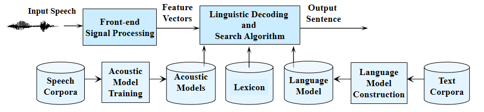

以输入语音为"This is speech"为例。

虽然人的语音是千变万化的，但组成语音的基本音（或者是音素）数量是有限的。于是我们可以将语音拆成一些基本音，例如"th-ih-s-ih-z-s-p-ih-ch"。然后为每个基本音建立一个pattern，就可以按照之前模式识别的方法做了。

我们可以使用大量语料训练**声学模型（acoustic model）**。它可以将输入语音转成基本音。我们要借助**词典（lexicon）**将它们拼起来组成一个个词，如"th-ih-s"拼成"this"。然而，有些音是很难分辨的，比如"th"和"s"。于是机器只能给出各个基本音的概率。而这些可能的基本音又可以串起来组成各种各样的词。

为了确定哪一种词的组合可能性最大，需要借助**语言模型（language model）**。它可以根据之前的词给出当前某个词出现的概率。换言之就是几个词一起出现的概率。n-gram的语言模型是指根据前n-1个词确定第n个词出现概率的模型。

### 1.2 语言模型

正如上面的例子所示，我们可以借助词典将基本音拼成一些合理的词。但这对识别出一句合理的句子而言还与那远不够。如下图，输入语音的内容是"The computer is listening"。但如果只用词典去孤立地拼词，"They come tutor is list sunny"出现地概率也很大，但这显然不是一句正确地话。

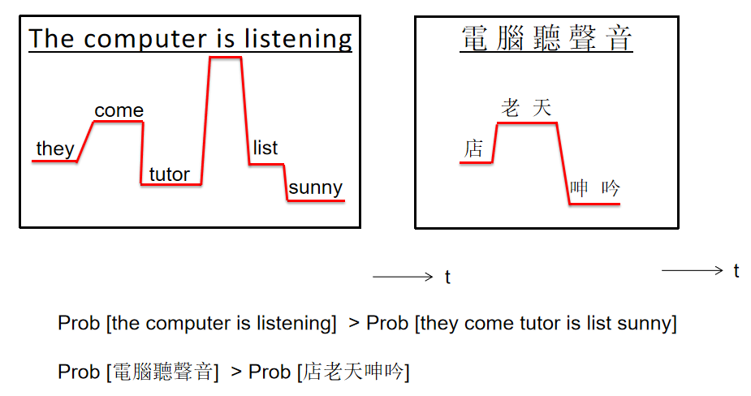

所以，我们就期待借助语言模型（language model）来设定一些语言限制（linguistic constraint），从而帮助机器选出正确的词。

### 1.3 信息与熵

上一章中简要介绍了信息论的知识。假设有一个信息源$s$，它能产生一些事件。这些事件都是有$M$种可能取值的随机变量。那么信息源的熵的计算公式如下。
$$
H(s)=\sum\limits_{i=1}^{M}P(x_i)I(x_i)=-\sum\limits_{i=1}^MP(x_i)\log P(x_i)=\mathbb{E}[I(x_i)]
$$
其中$I(x_i)$表示事件$m_i$结果为$x_i$时我们得到的信息量。之前提到过，概率越小的结果，其携带的信息量越大。此外，如果事件的每个结果发生的概率相同，即整个系统是完全混乱的（random），则此时系统的熵最大。因此我们可以知道$0\leq H(s)\leq \log M$。

例如有一个英语的language source，它可以产生一些列token，每个token是一个有着不同可能取值的随机变量。如果以character作为token，再加上标点符号，则总数会大于32而小于64，即$32<M<64$。另外还要考虑character本身是有一个distribution，即每个character出现的概率不尽相同。例如`t`显然要比`z`的频率更高。

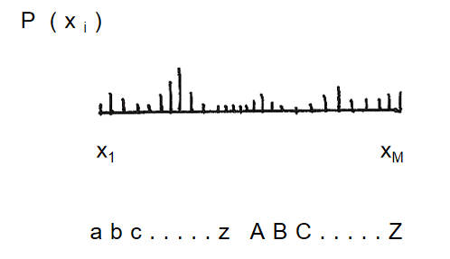

则我们看到一个character后可以得到不超过$\log 2^{6}=6$个bit的信息量。同理，如果token是word，假设英文中有30000个词，则我们没看到一个word后可以得到不超过$\log 2^{15}=15$个bit的信息。

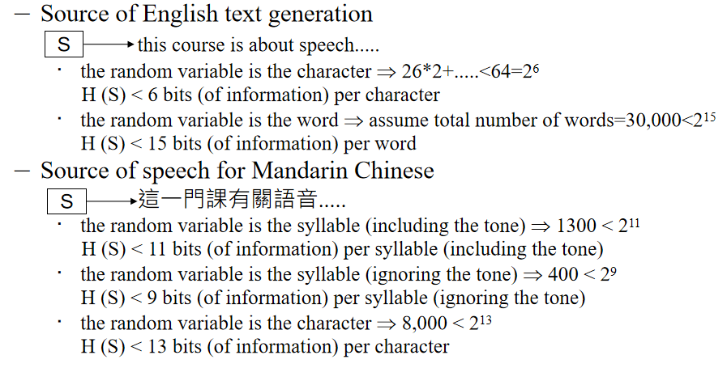

### 1.4 混淆度

假设词典里有十万个词，现在有一句话输入进来。**第一个词**的可能识别结果有十万种。因为有了unigram，我们可以知道这十万个词的分布，也就能计算出信息熵$H$。假设$H$为10个bit，那么这和1024个词均匀分布的信息熵是一样的。可以看到，信息熵可以反映选词时的难度（不确定性）。识别出第一个词后，因为有bigram，我们又可以得到另一个十万个词的分布，它应该会更加紧凑一些，即信息熵更小。假设其信息熵$H$为9个bit，那么这和512个词均匀分布的信息熵一样……

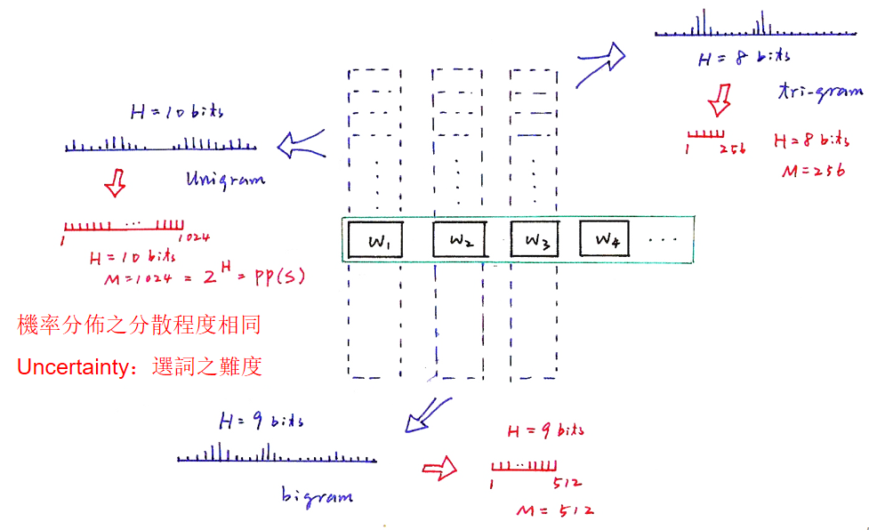

上面提到的**等价的均匀分布**称为虚拟词典（virtual vocabulary）。这么做称为branching factor estimate。其意义是虽然实际的词典中有十万个词，但在语言模型的帮助下，我们实际上只在很小一部分的分支之间做选择（1024->512...），如下图所示。

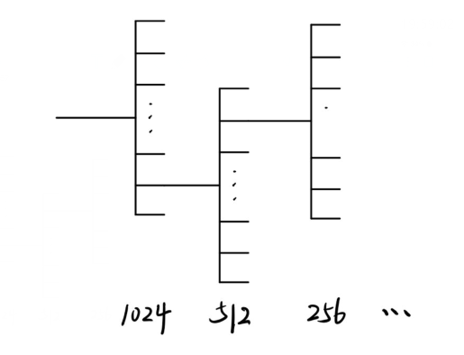

现在我们有一个语言模型$P(w_i|c_i)$，表示在给定条件$c_i$的情形下，词$w_i$出现的概率。对于unigram，$P(w_1)$的$c_1$为空集；对于bigram，$P(w_2|w_1)$的$c_2$就是$w_1$。

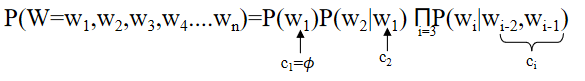

另外，我们会用一个测试语料库（test corpus）$D$来测试该语言性能。它有$N$个句子，其中第$i$个句子$W_i$有$n_1$个词，总共词的数目为$N_D$。

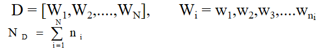

语言模型$P(w_i|c_i)$的在测试语料库$D$下信息熵计算方法如下。
$$
\begin{align}
H(P;D)&=-\frac{1}{N_D}\sum\limits_{i=}^N\sum\limits_{j=1}^{n_i}\log P(w_j|c_j) \\
&= \sum\limits_{i=}^N\sum\limits_{j=1}^{n_i}\log\Big[ P(w_j|c_j)^{\frac{1}{N_D}} \Big]
\end{align}
$$
这也就是所有$\log P(w_j|c_j)$的几何平均。接下来可以定义该语言模型的混淆度（perplexity）。
$$
PP(P;D)=2^{H(P;D)}
$$
同信息熵类似，混淆度反映了语言模型预测下一个词的能力。混淆度越小，效果越好。例如下图中，混淆度为312，也就意味着语言模型预测下一个词时，平均有312种可能选择。

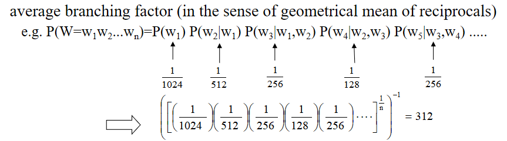

混淆度可以度量某个语言模型在给定的测试语料库（test corpus）上的效果。

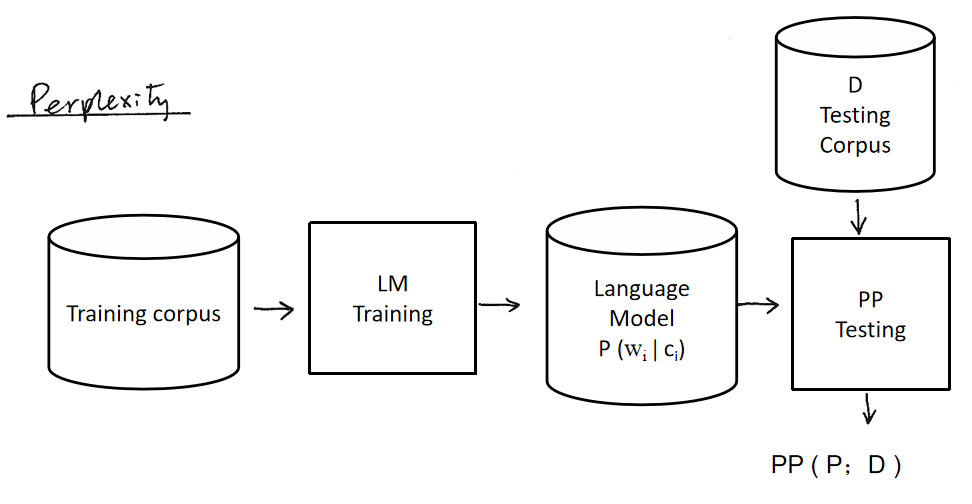

混淆度还可以理解成**某种**交叉熵（cross-entropy）。一般而言，对于概率分布$P(x)$和$Q(x)$，而交叉熵的计算公式如下。
$$
X(P(x)||Q(x))=\sum\limits_{i}P(x)\log Q(x)
$$
它类似KL散度，可以衡量两个分布之间的接近程度。根据大数定律知道：
$$
\lim\limits_{N\to\infty}\frac{1}{N}\sum\limits_{k=1}^N\log Q(x_k)=\sum\limits_{i}P(x)\log Q(x)
$$
即我们可以认为测试语料库定义了一个真实分布$P(x)$，而语言模型则估计了一个分布$Q(x)$。如果语言模型越好，则两个分布的交叉熵越小。可以发现$H(P;D)=X(D||P)$，而$PP(P;D)=2^{H(P;D)}$。这就是为何混淆度可以表示某种交叉熵了。

此外，我们可以针对某个领域专门训练一个语言模型，这样效果会更好。

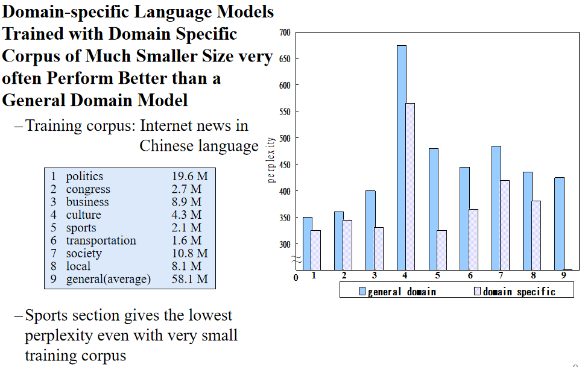

## 2 Smoothing

训练语料库（training corpus）中的数据并不能覆盖到真实情形下词的组合。例如训练数据中单独有"Jason"，也有"immediately"，但没有"Jason immediately"连在一起的情形。那么$P(immediately|Jason)=0$，也就无法识别"Jason immediately stands up"这句话，虽然它是一句很简单的话。

因此，接下来就要想方设法让那些语料库中没有的词和词的组合（unseen events）也能够有一定的概率，即smoothing。

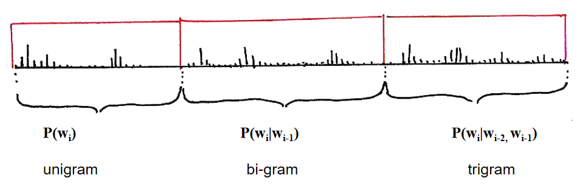

### 2.1 Add-one

最直觉的方法就是所有词出现的次数都加1，这样既让没出现过的词和词的组合也有一定概率，又保证了概率之和为1。

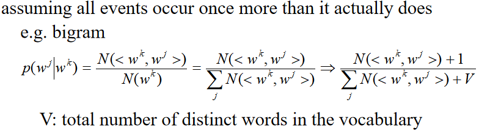

但实验表明该方法的效果一般。个人猜测原因是有些组合在现实中本来就没有却也和其它组合一样获得相同的概率，有种**都加等于没加**的感觉。

### 2.2 Back-off

退化（back-off）的想法是让原本有概率的组合保持不动，而概率为0的则根据一定的权重$a$退化到上一个gram的情形（$a$需要另外的方法设定）。

举例而言，语料库中有单独的"you"和"thou"，同时也有“you see”的组合，但没有"thou see"组合。此时，由于"thou"是古语，出现的频率比"you"低，则有$P(you)\geq P(thou)$。我们认为同样给定"see"作为下一个词的条件下，应该会有$P(you|see)>P(thou|see)$。在我们的语料库中，由于不存在"thou see"组合，那么$P(thou|see)$就退化到$aP(thou)$。

### 2.3 Interpolation

内插（interpolation）的想法是总是让n-gram和n-1 gram的概率做平均（$b$也要用另外的方法设定）。

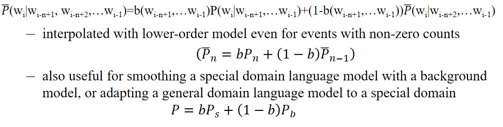

这种方法还可以让一个训练在各种领域语料的general model和一个训练在特定领域语料的specific model结合。例如我们要识别体育新闻主持人说的话。体育领域的模型可以有效识别专业的话，但如果主持人说了句与体育无关的话，那模型的表现会打折扣。此时如果加上一个general model，就可以让整个模型也能较好识别体育之外的话。

### 2.4 Good-turing

如下图，如果钓鱼时共钓了18条鱼，其中有3类鱼只有一条。我们认为这3类鱼都是**新**的，也就是18条鱼中有3条是新的。Good-turing方法的思想是用seen events中新鱼出现的概率表示从unseen events中得到一类新鱼的概率。

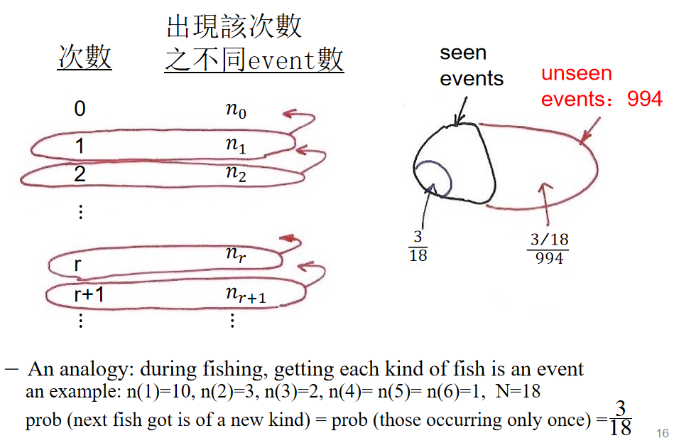

在语言模型中，其中$r$的含义是出现了$r$次的events，而$n_{r}$表示有多少这样的events。Good-turing的做法是把$n_{r+1}$给$n_r$，这样对于unseen events，即$r=0$的情形，$n_0=n_1$。同时，$r$要打折扣变成$r^*$，计算公式如下。
$$
r^*=(r+1)\frac{n_{r+1}}{n_r}
$$
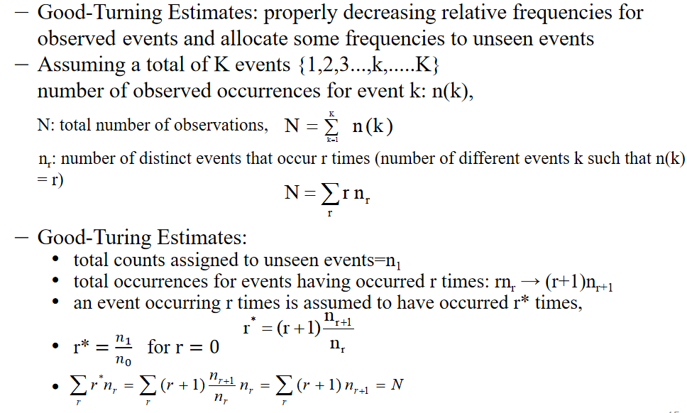

但是，如果出现最多的次数为$K$，那么$n_K$就会全部给$n_{K-1}$，导致$n_{K}=0$。然而，这些出现频率很高的events应该对我们正确识别有很大贡献。另外，对于unseen events，我们是将$n_r$在它们之间平均分配的，这并不合理。因为我们并不清楚它们之间有怎样的分布。

### 2.5 Katz

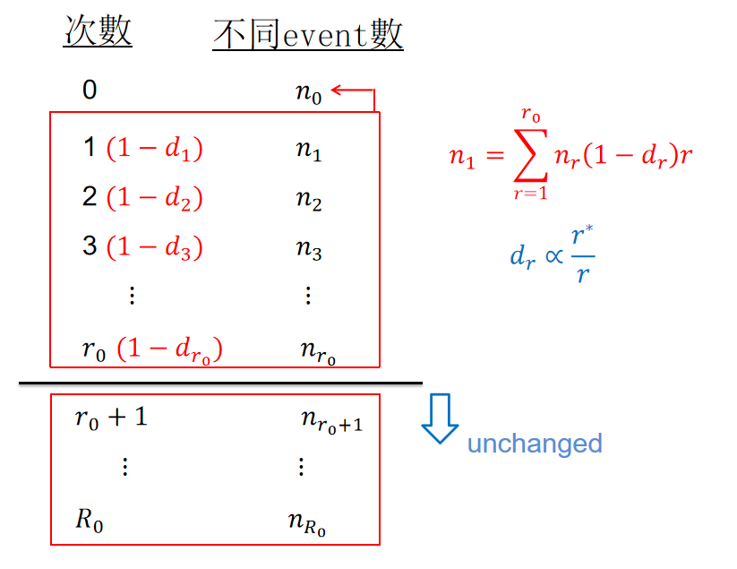

Katz的做法基于Good-turing，并考虑到出现频率较高的events的重要性，让它们的$n$保持不变。而对于出现频率较低的events，它们都都一些$n$给unseen events。

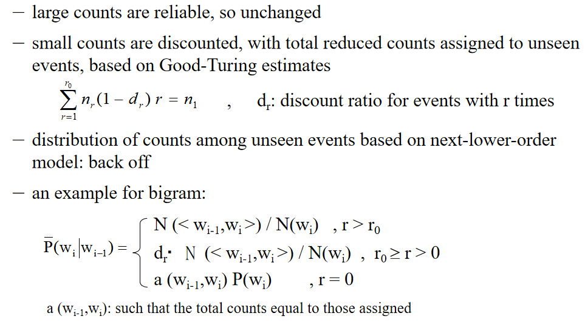

上图是bigram的情形。首先我们统计各种bigram组合出现的次数，并将它们如上述方法按照出现频率一一归类。例如"I see"出现了100次，而"come tutor"出现了0次，则它们分别归到$r=100$和$r=0$两类。

现在我们要计算某个bigram组合出现的概率。

- 如果$r>r_0$，则仍使用原本bigram概率的计算方法。
- 如果$r_0\geq r>0$，则给使用原本bigram概率的计算方法得到的概率打折扣。
- 如果$r=0$，即unseen event，则根据其unigram $P(w_i)$来分配从其它seen events分配的次数。

可以看到，Katz的方法解决了Good-turing存在的两大问题。

## 3 Class-based Language Modeling

Smoothing虽然已经给予了unseen events一些概率，但这似乎只是一种补偿，并没有让模型更intelligent。

Class-based的方法是考虑到人在用词时会思考词本身的语义（semantic）或文法（grammar）信息。例如某人可能没听过"speech recognition is awesome"，但听过"speech recognition is interesting"。因为他见过单独的"awesome"和"interesting"，并知道二者都是形容词，表达的含义也有一定关联，那么他也可以听懂（识别出）这句话。

同样对于机器，我们期待它能够对一些相似的词做聚类（clustering）。我们在做n gram的时候也就不再是以词为单位，**而是以class为单位**。这样，即便"John found"出现的次数可能很少，但由于"John"属于人名而"found"，人名后接与"found"同类的动词概率很大，那么"John found"也能得到较高的概率。

这种做法其实也可以看作是一种smoothing的方法，即把一个精确的词模糊/退化到其对应的类中。

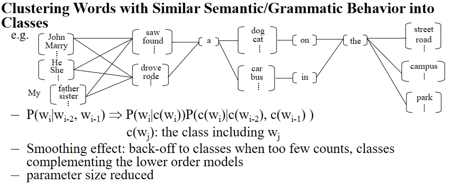

## 4 参考

[數位語音處理概論2021Autumn-week05 - YouTube](https://www.youtube.com/watch?v=hUdqGD5Zf80)

[数位语音信号处理概论 Lesson6 语言模型 - 知乎 (zhihu.com)](https://zhuanlan.zhihu.com/p/102143127)