# Lesson 7: Speech Signals and Front-end Processing

## 0 前言

2021秋课程主页：

[Speech Lab - Introduction to Digital Speech Processing (ntu.edu.tw)](https://speech.ee.ntu.edu.tw/DSP2021Autumn/)

心心念念的语音信号前端处理部分终于来了！这一章解决了我之前的很多疑惑和误解。不过因为我还没有修完信号与系统，对于诸如傅里叶变换、Z变换、卷积等等操作的具体数学过程还不太清楚，就只能一笔带过了……

2021春李琳山老师《信号与系统》课程主页：
[Speech Lab - courses信號與系統 Signals and Systems (ntu.edu.tw)](https://speech.ee.ntu.edu.tw/SS2022Spring/)


## 1 基础知识

### 1.1 Speech Source Model

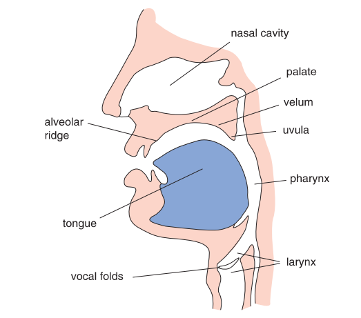

人的声道（vocal tract）构造入上图所示。我们在说话时，无规律气流从肺部上来经过声道的一系列处理变成有意义的语音。如下图，将这一过程抽象成source model，其中$u(t)$可以看作是一种激励（exitation），经过声道（可以看作是一个系统）变成语音$x(t)$

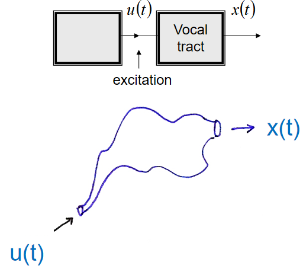


### 1.2 清音与浊音

肺部气流首先会抵达声带（vocal folds），它可以打开和关闭以控制气流的流动。我们发浊音（voiced sound）时，声带会以一定频率开关，导致气流也以一定频率送出；而发清音（unvoiced sound）时，声带完全打开，气流直接通过，也就没有固定的频率。下图中，左侧是声带的开关状态，其中突起处表示关闭，平直处表示打开。右侧是发出的语音信号。

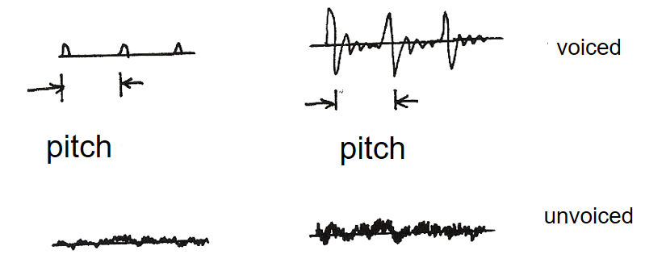

声道开关的频率也就是语音信号的基频（fundamental frequency）。而有的人将音高（pitch）和基频等同，也有人认为音高是基频的倒数。

对于浊音，具有一定频率的气流经过唇齿舌的一些列处理后会得到不同的语音信号。产生不同声调（tone）的机理是基频随时间变化不同。如下图，降调时基频随时间越来越低，而升调时基频随时间越来越高。

对于清音，没有一定频率的气流经过唇齿舌的一些列处理后也会得到不同的语音信号。


在英语中，浊音包括了所有元音（vowel）和一部分辅音（consonant），而清音则包括剩余的辅音。


### 1.3 时域与频域

语音的时域信号$x(t)$通过傅里叶变换后可以得到对应的频域信号$x(\omega)$。如下图，左右分别为浊音的时域和频域信号。如前述，浊音信号具有一定的频率。对应到时域上就是信号有一定的周期；对应到频域上就是各个“突起”之间有相同的频率间隔。相反，清音信号没有一定的频率，其时域信号也就没有一定的周期；频域信号的各个“突起”之间的间隔没有规律。

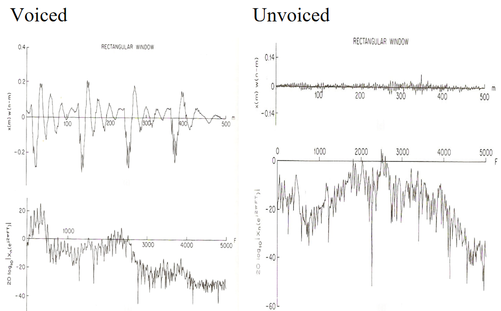

考察频域信号，可以发现浊音的amplitude总体随频率增大越爱越小；而清音则是越来越大。或者说，浊音信号主要集中在低频而清音信号主要集中在高频。

另一方面，不论是浊音还是清音，频域信号中都有几个峰（peak），它们称为共振峰（formant）。每个共振峰会对应到一个频率，称为共振峰频率（formant frequency）。通常，共振峰结构（formant structure）可以决定是哪个音。

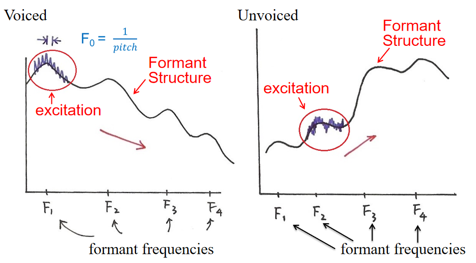


### 1.4 Spetrogram

时域信号看不出频域信息而频域信号看不出时域信息。时频谱（spectrogram）则将二者相结合。

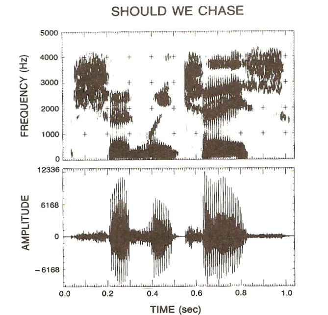

先对时域信号做加窗，然后对窗内的信号做傅里叶变换得到频域信号。多个随时间推进的window扫过整个时域信号后就可以得到时频谱。

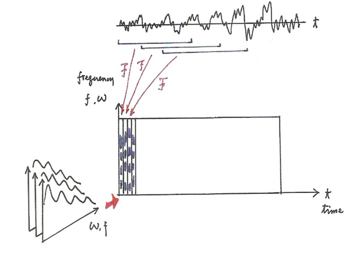

时频谱中深颜色的条就是共振峰。如前述，不同的音会有不同的共振峰结构。实际上，我们可以仅根据第一共振峰$F_1$和第二共振峰$F_2$就能够大致区分各个音。

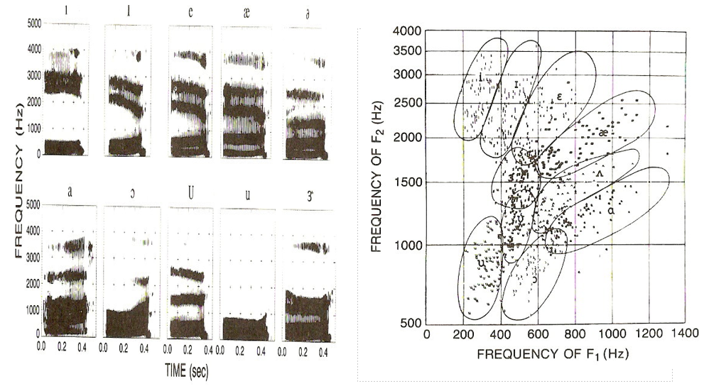

借助[WaveSurfer](https://www.speech.kth.se/wavesurfer/index.html)可以很方便地查看时频谱、共振峰曲线以及音高的曲线。

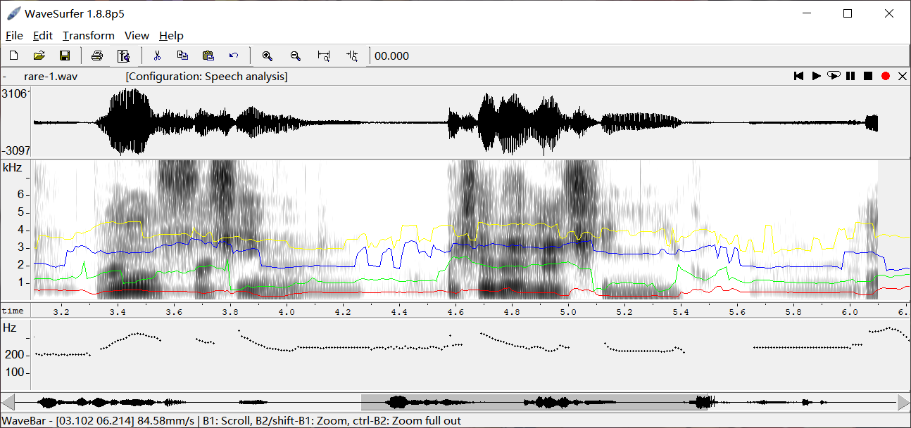

有趣的是，之前训练过一个声音转换（voice conversion）的模型，生成语音的共振峰曲线完全是平直的。

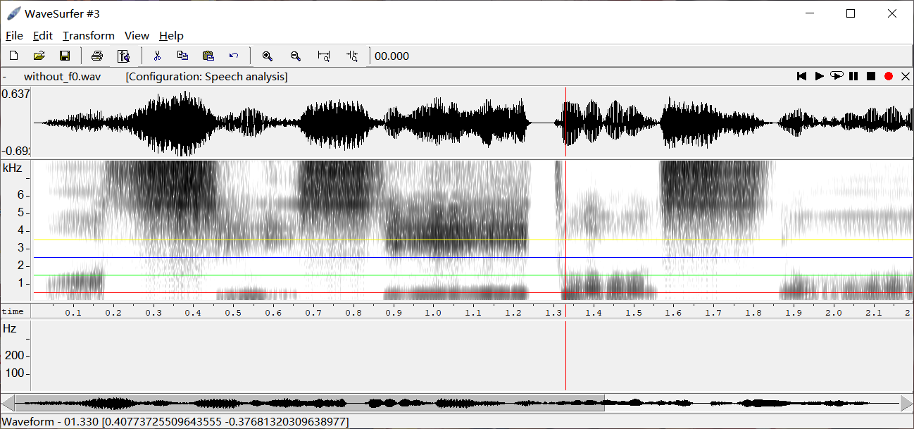


## 2 Speech Source Model

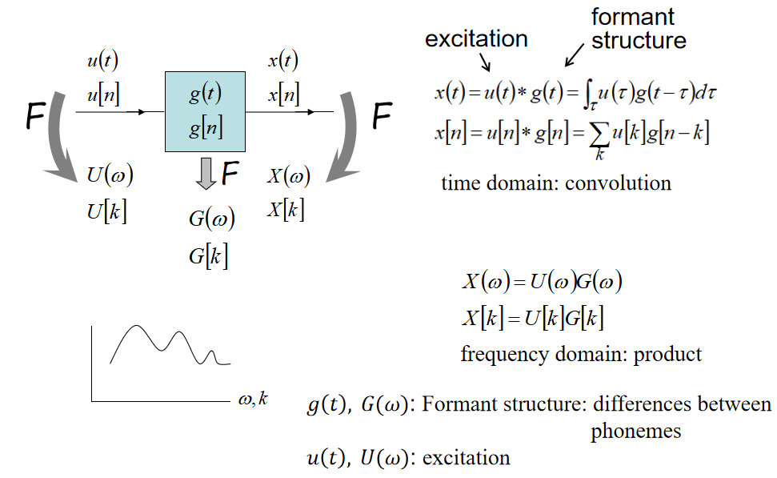

上图是前述speech source model的数学模型。$u(t)$作为激励源（exitation），具有音的清浊与频率信息。它经过唇齿舍等发声器官的一些列作用之后就变成各种各样的语音信号$x(t)$。其中，将唇齿舍等发声器官的作用$g(t)$主要就决定了共振峰结构。

时域上，我们认为$u(t)$和$g(t)$经过卷积操作可以得到$x(t)$；而在频域上，则认为$U(\omega)$和$G(\omega)$经过乘积操作可以得到$X(\omega)$。下图是speech source model更具体的结构。


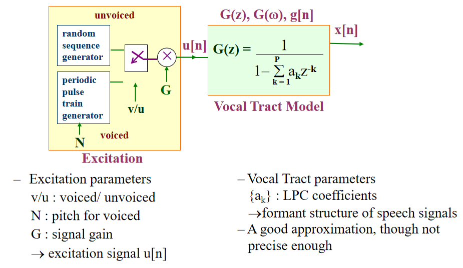


## 3 MFCC

梅尔谱倒谱系数（mel-frequency cepstral coefficients, MFCC）在语音识别中有着广泛的运用。使用它可以在较小的计算量下就得到准确的结果。其提取流程如下图所示。

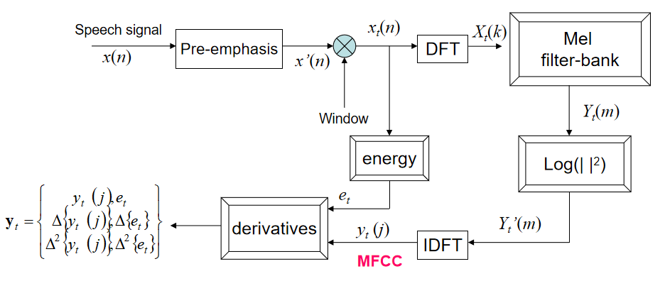


### 3.1 预加重

> Voiced sections of the speech signal naturally have a negative spectral slope (attenuation) of approximately 20 dB per decade due to the physiological characteristics of the speech production system.
>
> High frequency formants have small amplitude with respect to low frequency formants. A pre-emphasis of high frequencies is therefore helpful to obtain similar amplitude for all formants

人在说话时，受发声系统特性的影响，声音的低频部分变化不大但高频部分会受到抑制。比如浊音的频率每升高1倍，其响度就会衰减20分贝。另一方面，高频处共振峰的幅度也会变小。

人耳仍然可以辨识出被抑制的高频信号但机器不行。于是我们使用预加重（pre-emphasis）的方法（相当于一个高通滤波器）把高频信号**提上来**而低频部分基本保持不变，从而方便机器识别。

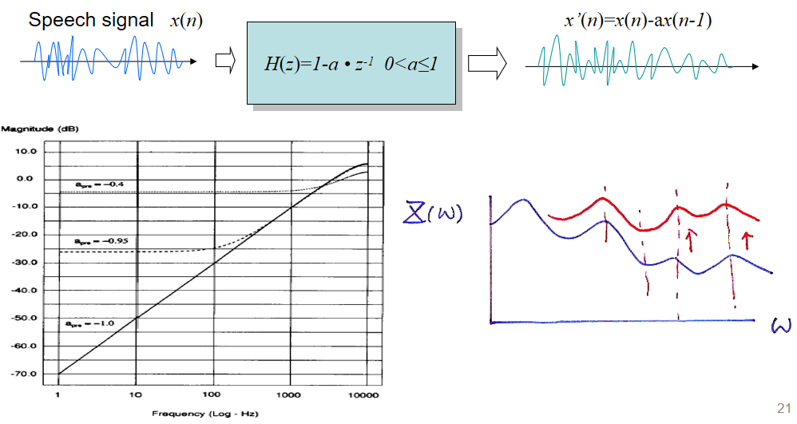


### 3.2 分帧

之所以要做分帧（framing），是因为一整段语音信号是不断变化的，只有在很小一段时间中是相对固定的（short-time stationnary）。如果直接对整个信号做傅里叶变换，得到的结果会很模糊。于是我们会将一整段音频切成一个个帧，并且帧与帧之间会有重合（overlap），然后再对帧内的信号做短时傅里叶变换（short-time Fourier transform, STFT）。


### 3.3 加窗

直接对分帧后的信号做短时傅里叶变换，实际上就是给信号加了个矩形窗（rectangular window）。设做了预加重的时域信号为$x^{,}(n)$，窗函数为$w(n)$，加窗后的信号为$x_t(n)$，则加窗的过程可以表示为：
$$
x_t(n)=w(n)\cdot x^{,}(n)
$$
而在频域上则是卷积操作：
$$
X_t(\omega)=W(\omega)*X^{,}(\omega)
$$
接下来以矩形窗为例，介绍主瓣（main lobe）与旁瓣（side lobe）的概念。我们对时域上的窗函数做傅里叶变换后可以得到其频谱。再对频谱取绝对值可以得到下图中右上角的图。其中高耸的部分就称为主瓣，周围较低的部分称为旁瓣。而右下方的图则是对频谱取对数，从而更清晰地看到主瓣和旁瓣的大小关系。

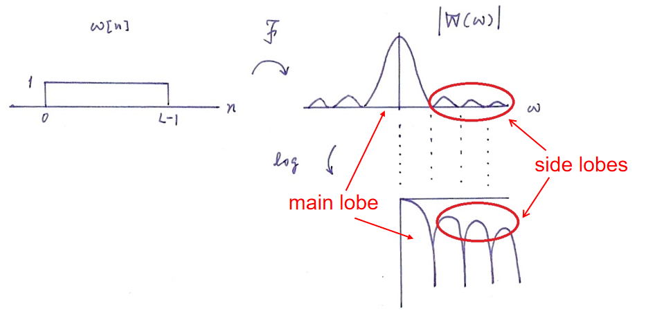

如前述，加窗在时域上是信号和窗函数相乘；而在频域上则是信号和窗函数做卷积操作。主瓣和旁瓣在加窗过程中分别会有一下问题。

> Main lobe spreads out the narrow band power of the signal (that around the formant frequency) in a wider frequency range, and thus reduces the local frequency resolution in formant allocation.
>
> Side lobe swaps energy from different and distant frequencies.

主瓣会模糊掉频域信号的frequency resolution，这会让机器更难准确找到共振峰；而旁瓣则会交换那些差异较大频率对应的energy，也就是会把频谱弄乱。因此我们期待主瓣越窄越好而旁瓣越矮越好，但这是无法得兼的。

我们宁可让frequency resolution低一些，也不希望信号被弄乱，于是通常会使用汉明窗（hamming window）。

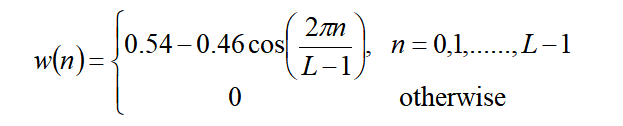

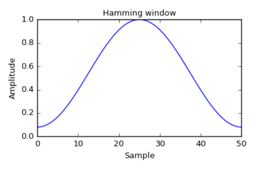

汉明窗与矩形窗的主瓣和旁瓣大小对比图如下，可以看到汉明窗有效降低了旁瓣。

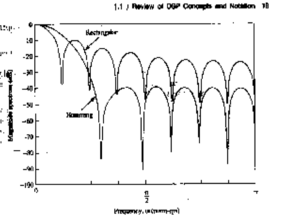


### 3.4 滤波

加窗后的一小段时域信号首先通过离散傅里叶变换（DFT）变为频域信号。如果时域信号有$L=512$个sample，那么频域信号也有$L=512$个点。

接着分别将$M$个梅尔滤波器（mel-filter bank）加到频域信号上。

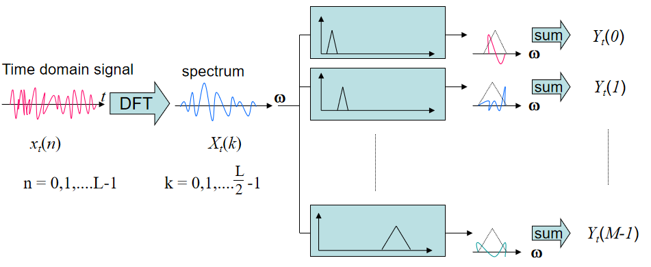

这些filter的位置的排布是有讲究的。如果横坐标是频率$\omega$，则相邻filter之间的间距是按指数级变化的；而如果横坐标是$\log \omega$，则相邻filter之间是等距的。注意，为了不让低频部分的filter过于密集，其排布方式在频率坐标上是**线性的**。


经过fbank滤波之后的信号取$\log |\cdot|^2$后可以得到fbank特征。把所有frame对应的fbank沿时间轴拼起来就得到了梅尔谱。

>**Why magnitude (or energy)？**
>
>时域信号经短时傅里叶傅里叶变换后可以得到magnitude和phase的信息，但我们取fbank特征时只保留的magnitude。这是因为人耳相位信息不敏感。如果用随机的相位替换掉原始的相位，人耳是几乎无法区分的。
>
>**Why logarithmic operation**
>
>对滤波后的信号取平方后可以得到能量，而又引入一个对数操作是考虑到人耳对能量的感知也是log scale的。此外它还对接下来提取MFCC有重要作用。


### 3.5 IDFT

刚刚提取的fbank中各个维度之间是高度相关的，我们期待使用去相关的技术来压缩这些特征。上一步得到的对数功率谱（log-power spectrum）是对称的，且每个元素都是实数。于是做逆离散傅里叶变换（inverse discrete Fourier transform）就退化成了离散余弦变换（discrete cosine transform）。

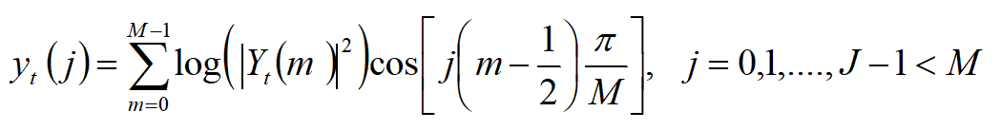

如前述，在频域上看，决定音的种类的是共振峰结构，而那些“小突起”影响的是清浊、音高等更为精细的特性。

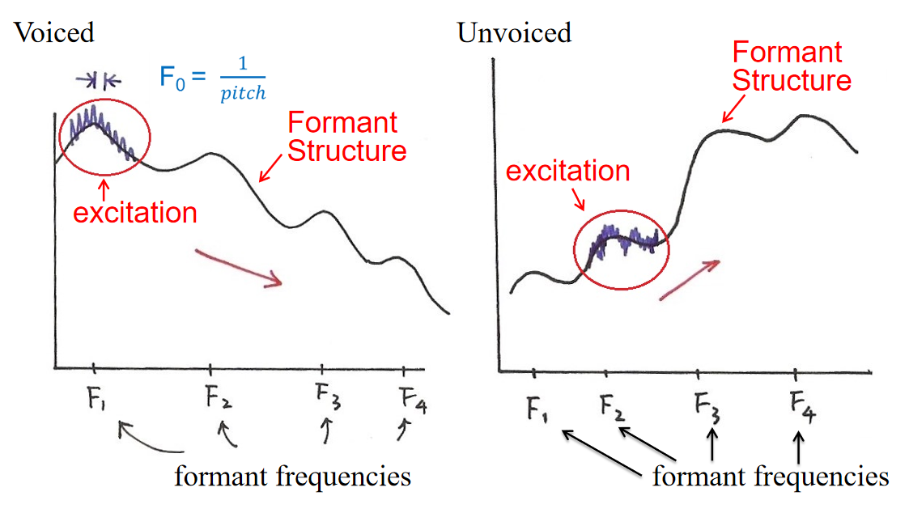

下面是给功率谱取对数的重要原因。之前提到，在时域上做卷积，对应到频域上就是做乘积。反过来，在频域上做卷积，对应到时域上就是做乘积。此处，我们可以把上图的频域信号看成某种”时域信号”。那么该信号$X(\omega)$可以看作是具有共振峰结构信息“低频信号“$G(\omega)$和具有音的精细特征信息的”高频信号“$U(\omega)$之间经过卷积操作得来的。那么经过IDFT后就将该”时域信号“转成了”频域信号“。那么$G(\omega)$和$U(\omega)$对应的”频域信号“就做了乘积操作。取对数就变成了加和操作，从而可以实现分离，即取”低频“部分的信号。


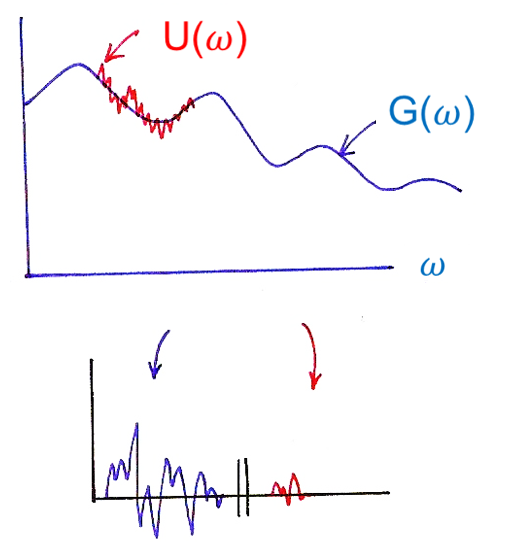


### 3.6 动态特征

做完IDFT后我们已经得到了MFCC，但它只反映了静态特征，即每个孤立时间点的特征。接下来让MFCC的每个点对时间做一次微分和二次微分后就能得到动态特征。

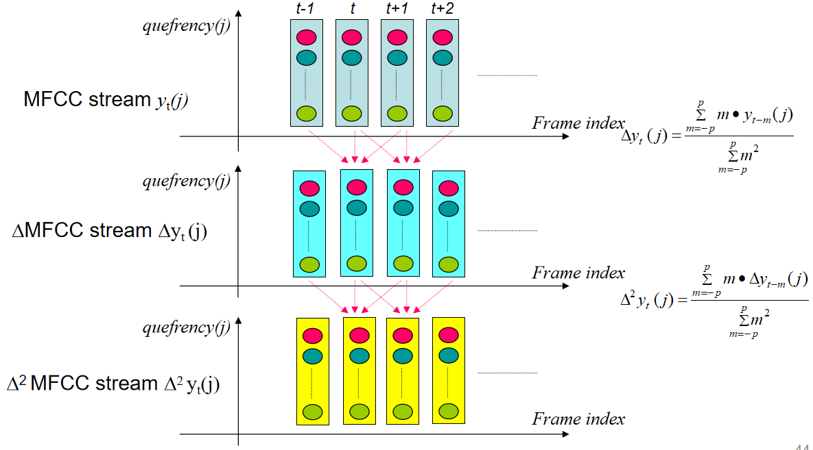

算$t$时刻的点对时间的微分时，可以直接用$t$时刻的点减去$t-1$时刻的点（差分法）。但这样不尽准确，我们可以采用线性回归（linear regression）的方法，让一条直线拟合相邻的多个点，则该直线的斜率就作为微分取值。

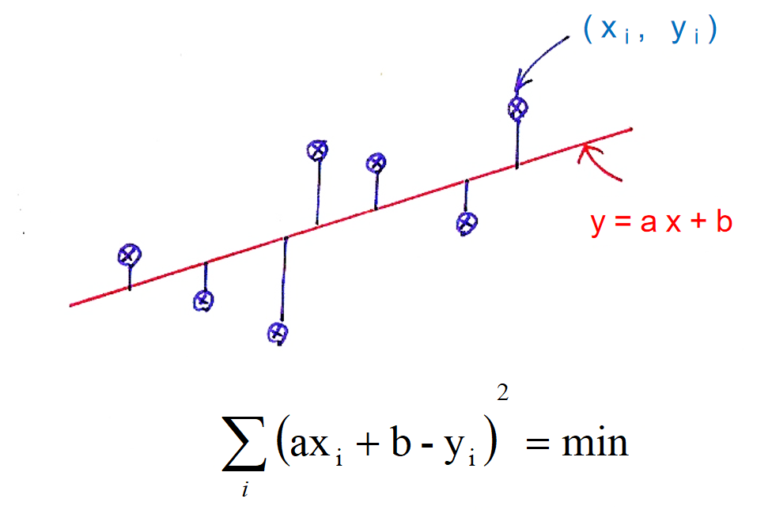

此外，做微分的好处还在于它能去除channel distortion的影响。比如时域信号$x[n]$受到某些干扰$h[n]$变成$y[n]$，可以知道该过程就相当于$x[n]$和$h[n]$做卷积操作。经过MFCC提取后，二者就变成了加和的关系，那么取微分就可以消除$h$的影响。

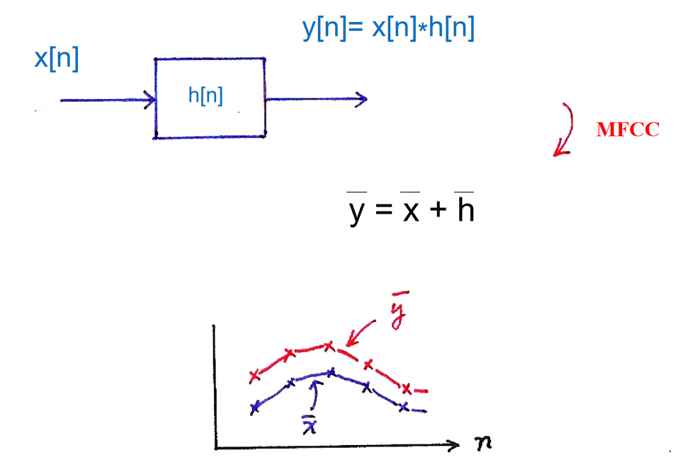


## 4 MFCC提取实作

该部分完全参照[这篇教程](https://haythamfayek.com/2016/04/21/speech-processing-for-machine-learning.html)。

### 4.1 准备

这里我使用了一段时长3.5秒，位深16，采样率为22050 Hz的音频。

```python
import numpy
import scipy.io.wavfile
from scipy.fftpack import dct

sample_rate, signal = scipy.io.wavfile.read('/content/ayaka-1.wav')  
signal = signal[0:int(3.5 * sample_rate)]  # 取前3.5秒的音频
```

时域信号如下图。


### 4.2 预加重

公式如下，其中$0\ll\alpha<1$，这里取0.97。
$$
y(x)=x(t)-\alpha x(t-1)
$$

```python
pre_emphasis = 0.97
emphasized_signal = numpy.append(signal[0], signal[1:] - pre_emphasis * signal[:-1])
```

预加重后的时域信号如下图。

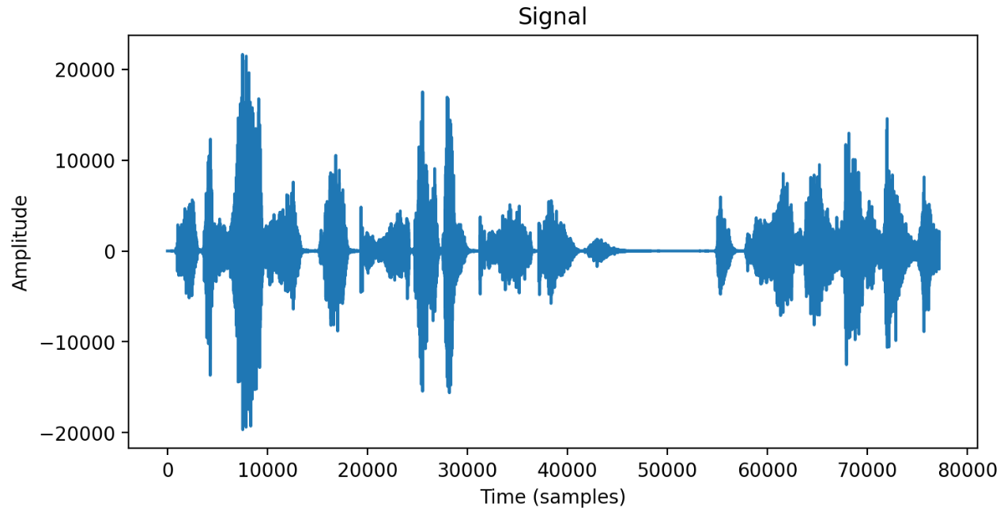


### 4.3 分帧

有关分帧的参数如下。

| 参数         | 含义                                                         |
| ------------ | ------------------------------------------------------------ |
| sample rate  | 采样率。                                                     |
| frame size   | 一帧的时长，通常取20至40ms。太长会导致time resolution变小；太短会导致运算成本加大。 |
| frame length | 一帧内sample的数量，即frame size和sample rate的乘积。        |
| frame stride | 相邻两帧间隔的时长，不能大于帧长（保证有帧之间有重合），通常取10ms。 |
| frame rate   | 一秒内帧数。                                                 |
| frame num    | 整个信号所需要的帧数。一般希望所需要的帧数是个整数值，所以这里要对信号补0（zero padding）让信号的长度正好能分成整数帧。 |

要注意有时原始信号不一定能正好分成整数个帧，此时就要在信号的尾部补0。

```python
frame_size = 0.025
frame_stride = 0.01
frame_length, frame_step = frame_size * sample_rate, frame_stride * sample_rate 
signal_length = len(emphasized_signal)
frame_length = int(round(frame_length))
frame_step = int(round(frame_step))
num_frames = int(numpy.ceil(float(numpy.abs(signal_length - frame_length)) / frame_step))  # 保证至少有1帧

pad_signal_length = num_frames * frame_step + frame_length
z = numpy.zeros((pad_signal_length - signal_length))
pad_signal = numpy.append(emphasized_signal, z) # 补0

indices = numpy.tile(numpy.arange(0, frame_length), (num_frames, 1)) + numpy.tile(numpy.arange(0, num_frames * frame_step, frame_step), (frame_length, 1)).T
print(numpy.tile(numpy.arange(0, frame_length), (num_frames, 1))) # 每一帧的内的相对index
print(numpy.tile(numpy.arange(0, num_frames * frame_step, frame_step), (frame_length, 1)).T) # 所有帧中，每一帧头部的index
frames = pad_signal[indices.astype(numpy.int32, copy=False)]
```

每一帧有551个sample。其中一帧的时域信号如下。

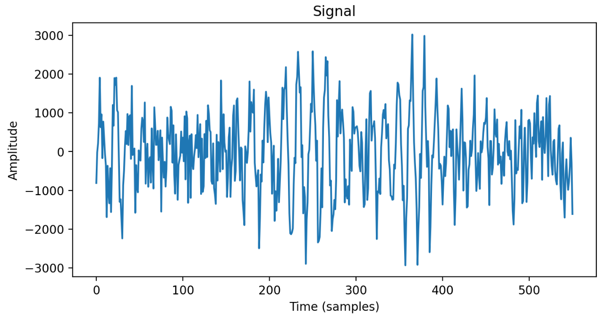


### 4.4 加窗

使用汉明窗。

```python
frames *= numpy.hamming(frame_length)
```

加窗后上面那一帧的时域信号如下。

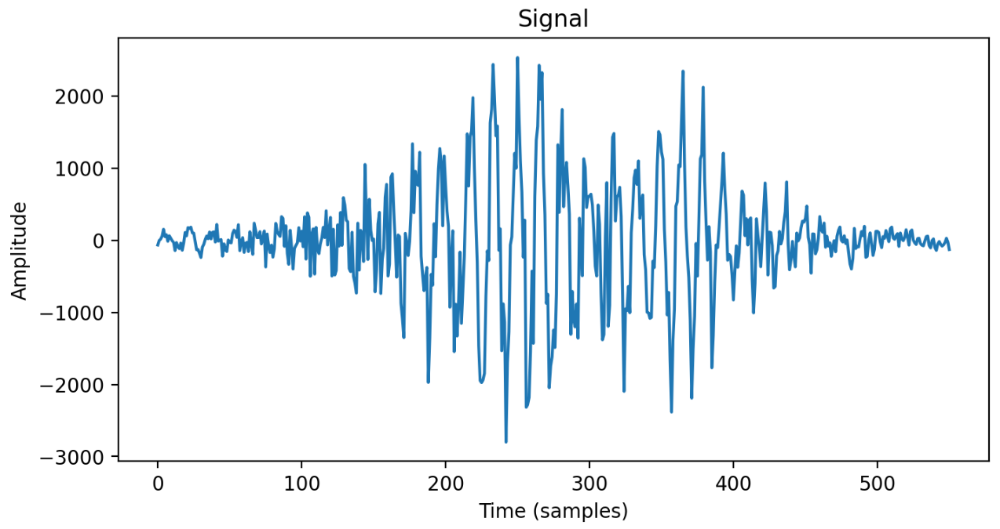


### 4.5 傅里叶变换

先对每一帧做$N$个点的短时傅里叶变换可以得到magnitude，从而得到功率谱。
$$
P = \frac{|FFT(x_i)|^2}{N}
$$
其中$x_i$表示第$i$帧中的信号；$N$​通常取256或512，此处取512。要注意每一帧中信号的点数大于$N$会降低frequency resolution。但因为此处一帧中有551个点，与512接近，于是忽略。

```python
NFFT = 512
mag_frames = numpy.absolute(numpy.fft.rfft(frames, NFFT))  # Magnitude of the FFT
pow_frames = ((1.0 / NFFT) * ((mag_frames) ** 2))  # Power Spectrum
```

如下图，将功率转成分贝就可以得到时频谱。


### 4.6 滤波

频率$f$和梅尔刻度$m$之间的转换公式如下。
$$
m=2596\log_{10}{(1+\frac{f}{700})}\\
f=700(10^{m/2596}-1)
$$
$m$随$f$的变换如下图。

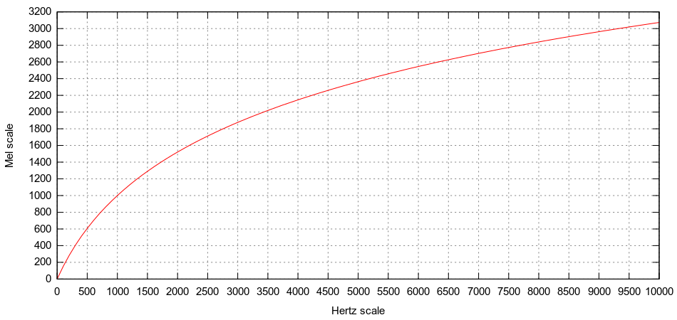

首先设计fbank。假设我们取$M=40$个三角形的filter。如前述，在$\log \omega$刻度上，相邻的filter之间是等距的。实际上，我们会根据上述$f$转$m$的公式，在梅尔刻度上等距设定filter。然后再将每个每个三角形filter的三个顶点对应的梅尔刻度值$m$都转回频率$f$。

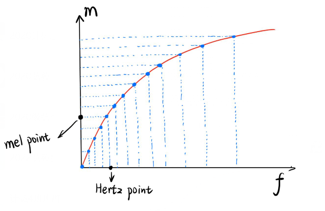

对应filter的改变如下。

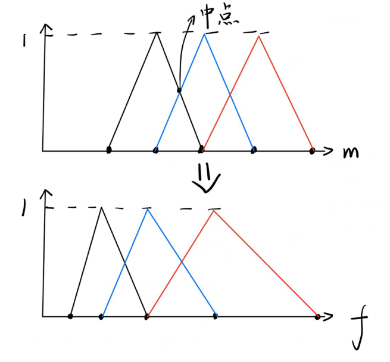

实际运算时，fbank会用一个$[M, N_F]$的矩阵表示，其中$N_F$表示经过傅里叶变换后的一帧中有多少个点。其中某一行的第$k$个元素的值的计算方法如下。
$$
\begin{equation}
H_m(k)=
\begin{cases}
0& \text{ $ k < f(m-1) $ } \\
\frac{k-f(m-1)}{f(m)-f(m-1)}& \text{ $ f(m-1) \leq k \leq  f(m) $ } \\
\frac{f(m+1)-k}{f(m+1)-f(m)}& \text{ $ f(m) \leq k \leq  f(m+1) $ } \\
0& \text{ $ k > f(m+1) $ } \\
\end{cases}
\end{equation}
$$
其中$m$表示filter的序号；$f(m-1)$，$f(m)$和$f(m+1)$分别表示该filter的起始点，中间点和结束点的索引。

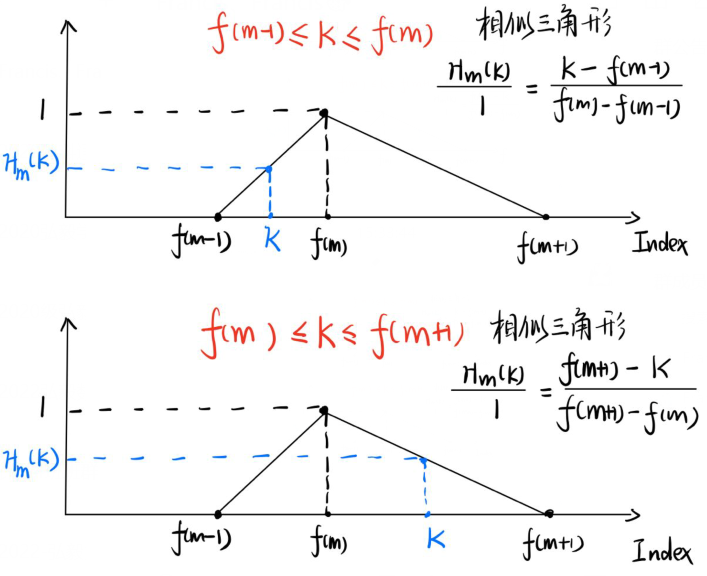

制作fbank的代码如下。

```python
nfilt = 40
low_freq_mel = 0
high_freq_mel = (2595 * numpy.log10(1 + (sample_rate / 2) / 700))  # f转m
mel_points = numpy.linspace(low_freq_mel, high_freq_mel, nfilt + 2)  # 在梅尔刻度上等分
hz_points = (700 * (10**(mel_points / 2595) - 1))  # m转f
bin = numpy.floor((NFFT + 1) * hz_points / sample_rate)

fbank = numpy.zeros((nfilt, int(numpy.floor(NFFT / 2 + 1))))

for m in range(1, nfilt + 1):
    f_m_minus = int(bin[m - 1]) 
    f_m = int(bin[m])         
    f_m_plus = int(bin[m + 1])    

    for k in range(f_m_minus, f_m):
        fbank[m - 1, k] = (k - bin[m - 1]) / (bin[m] - bin[m - 1])
    for k in range(f_m, f_m_plus):
        fbank[m - 1, k] = (bin[m + 1] - k) / (bin[m + 1] - bin[m])
```

可视化fbank。

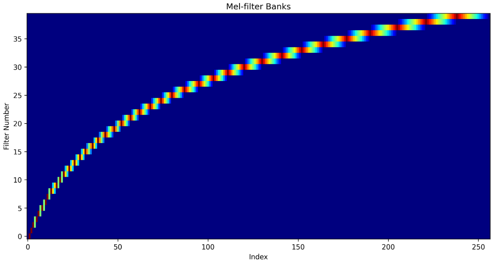

将fbank作用在功率谱上即可得到梅尔谱。

```python
filter_banks = numpy.dot(pow_frames, fbank.T)
filter_banks = numpy.where(filter_banks == 0, numpy.finfo(float).eps, filter_banks)
filter_banks = 20 * numpy.log10(filter_banks)  # dB
```

梅尔谱如下图。

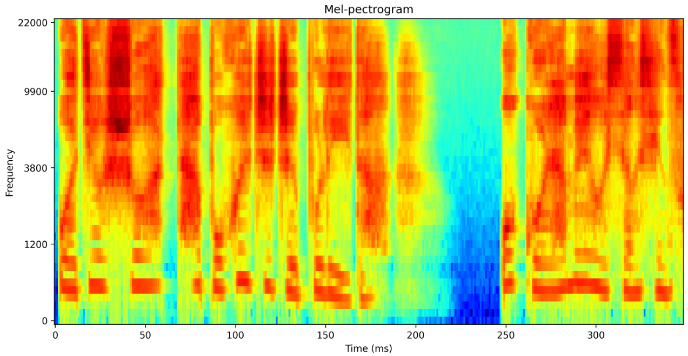


### 4.7 逆傅里叶变换

```python
num_ceps = 13
mfcc = dct(filter_banks, type=2, axis=1, norm='ortho')[:, 1 : (num_ceps + 1)] 
```

MFCC图谱如下。

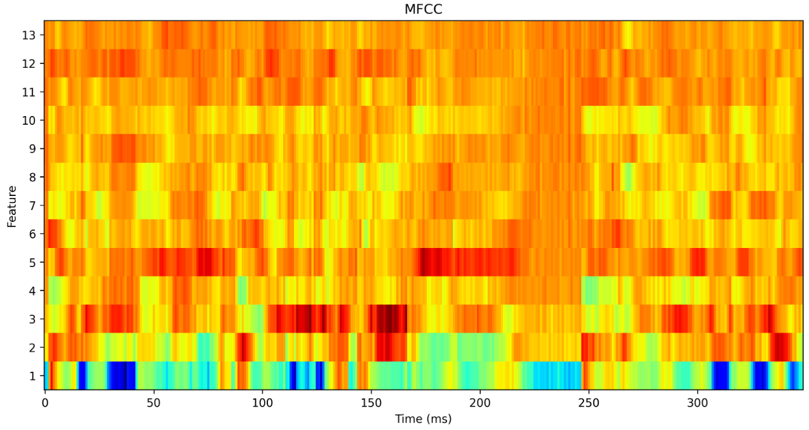


### 4.8 动态特征

这里我没有用线性回归，而是差分法。

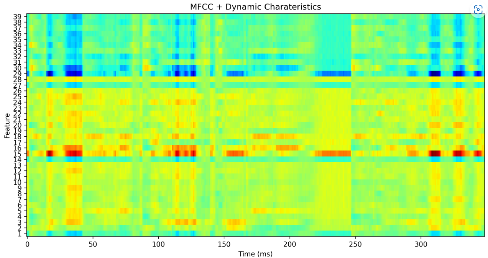


## 5 参考

[數位語音處理概論2021Autumn-week06 - YouTube](https://www.youtube.com/watch?v=tQwTxju3QbM)

[數位語音處理概論2021Autumn-week07 - YouTube](https://www.youtube.com/watch?v=PM71pJl9QhU)

[语音特征提取: 看懂梅尔语谱图(Mel-spectrogram)、梅尔倒频系数(MFCCs)的原理_BeichenLiu.Polaris的博客-CSDN博客_melspectrogram](https://blog.csdn.net/weixin_50547200/article/details/117294164)

[Speech Processing for Machine Learning: Filter banks, Mel-Frequency Cepstral Coefficients (MFCCs) and What’s In-Between | Haytham Fayek](https://haythamfayek.com/2016/04/21/speech-processing-for-machine-learning.html)

[Understanding the Mel Spectrogram | by Leland Roberts | Analytics Vidhya | Medium](https://medium.com/analytics-vidhya/understanding-the-mel-spectrogram-fca2afa2ce53)